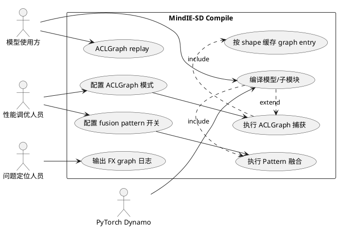
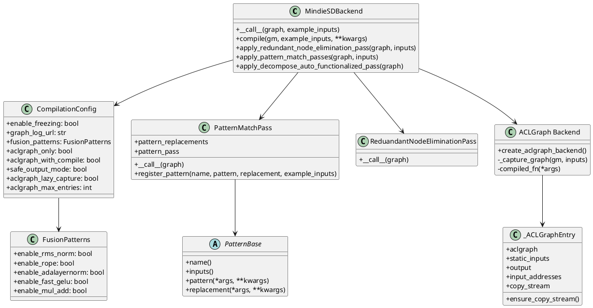
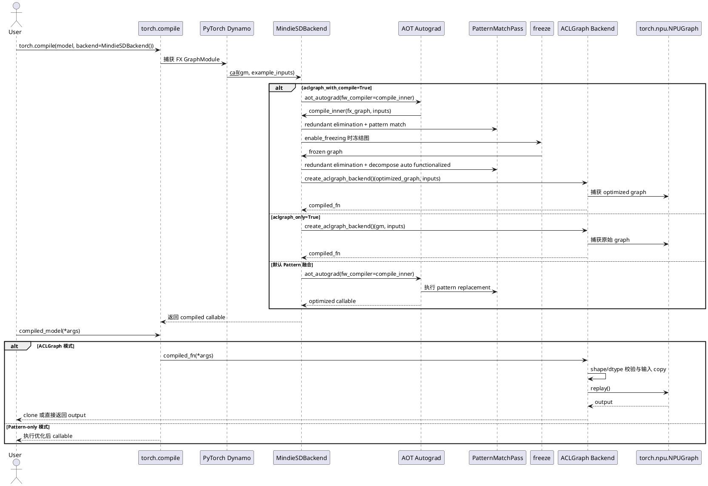

# Compile 设计说明书

## 需求背景

扩散模型推理链路中存在大量形状稳定、重复执行的计算子图。直接使用 PyTorch eager 模式会产生动态图调度、冗余算子执行和多 kernel 启动开销。MindIE-SD 通过 `torch.compile` 接入自定义编译后端，在不改变模型主体代码的前提下完成 FX 图优化、融合算子替换和 ACLGraph 静态图 replay。

Compile 模块提供两类互补能力：

- Pattern 融合：在 FX 图中识别 RMSNorm、RoPE、AdaLayerNorm、fastGELU、Mul+Add 等算子组合，并替换为 MindIE-SD 融合算子。
- ACLGraph 加速：将形状稳定的 NPU 计算捕获到 `torch.npu.NPUGraph`，后续 replay 跳过动态图调度。

## 设计目标

- 通过 `MindieSDBackend()` 作为 `torch.compile` backend 统一承载编译优化。
- Pattern 融合与 ACLGraph 由 `CompilationConfig` 统一开关控制。
- 编译前后分阶段执行 FX pass，降低 freezing、CSE 与 pattern 匹配之间的相互影响。
- 支持 ACLGraph-only 和 compile+ACLGraph 两种模式。
- ACLGraph replay 支持输入拷贝、shape/dtype 校验、输出安全 clone、lazy capture 和缓存容量控制。
- 保持 PyTorch 版本兼容，兼容 2.1 与 2.2+ 的 pattern matcher 差异。

## 总体方案

Compile 链路以 `torch.compile(model, backend=MindieSDBackend())` 为入口。PyTorch Dynamo 捕获模型图后，将 FX GraphModule 和 example inputs 传入 `MindieSDBackend.__call__`。后端根据 `CompilationConfig` 选择执行路径：

| 模式 | 配置 | 行为 |
|------|------|------|
| Pattern 融合 | 默认 | 执行 FX pass 和 pattern replacement，返回优化后的 callable |
| ACLGraph only | `aclgraph_only=True` | 跳过 Pattern 融合，直接捕获 ACLGraph |
| Compile + ACLGraph | `aclgraph_with_compile=True` | 先执行 Pattern 融合，再捕获 ACLGraph |

Pattern 融合依赖 `PatternBase` 抽象类描述 pattern、replacement 和 example inputs，通过 `register_pattern_to_pass` 注册到全局 `PatternMatchPass`。ACLGraph 后端通过输入 shape 建立 graph entry cache，每个 entry 保存静态输入、捕获输出、NPUGraph 和拷贝 stream。

## 接口设计

```python
import torch
from mindiesd.compilation import MindieSDBackend, CompilationConfig

CompilationConfig.fusion_patterns.enable_rms_norm = True
CompilationConfig.fusion_patterns.enable_rope = True
CompilationConfig.aclgraph_with_compile = True
CompilationConfig.safe_output_mode = True

compiled_model = torch.compile(model, backend=MindieSDBackend())
out = compiled_model(*inputs)
```

核心配置如下：

| 配置项 | 默认值 | 说明 |
|--------|--------|------|
| `enable_freezing` | `True` | 编译过程中执行 freezing 和常量折叠 |
| `graph_log_url` | `None` | FX graph transform observer 日志 URL |
| `fusion_patterns.enable_rms_norm` | `True` | RMSNorm pattern 开关 |
| `fusion_patterns.enable_rope` | `True` | RoPE pattern 开关 |
| `fusion_patterns.enable_adalayernorm` | `True` | AdaLayerNorm pattern 开关 |
| `fusion_patterns.enable_fast_gelu` | `True` | fastGELU pattern 开关 |
| `fusion_patterns.enable_mul_add` | `True` | Mul+Add pattern 开关 |
| `aclgraph_only` | `False` | 仅使用 ACLGraph |
| `aclgraph_with_compile` | `False` | Pattern 融合后再捕获 ACLGraph |
| `safe_output_mode` | `True` | replay 输出是否 clone |
| `aclgraph_lazy_capture` | `False` | 是否在首次真实输入时捕获 |
| `aclgraph_max_entries` | `0` | ACLGraph 缓存容量，0 表示不限制 |

## 用例图

用例图描述 Compile 模块对外提供的能力。模型使用方只需要调用 `torch.compile` 并传入 `MindieSDBackend`；性能调优人员通过 `CompilationConfig` 控制 fusion 和 ACLGraph；测试与定位人员通过 graph 日志、pattern 开关和 ACLGraph 配置缩小问题范围。



## 类图

类图描述 Compile 模块的静态结构。`MindieSDBackend` 是后端入口，负责编排 pass、freezing、AOT Autograd 和 ACLGraph backend；`CompilationConfig` 是全局静态配置；`PatternMatchPass` 维护 pattern replacement；`create_aclgraph_backend` 生成闭包形式的 ACLGraph backend，内部通过 `_ACLGraphEntry` 保存捕获状态。



## 时序图

时序图描述默认 compile+pattern 和可选 ACLGraph 的执行顺序。编译阶段由 Dynamo 触发，Pattern 融合只处理 FX 图；ACLGraph 捕获阶段使用 example inputs 或首次真实输入建立静态输入 buffer；推理阶段将新输入拷贝到静态 buffer 后 replay 图。



## 模块设计

### MindieSDBackend

`MindieSDBackend` 是 `torch.compile` 的后端入口。`__call__` 根据 `CompilationConfig` 选择三条路径：

- `aclgraph_with_compile=True` 且 NPU Graph 可用：先调用 `compile` 做 Pattern 融合，再用 ACLGraph backend 捕获。
- `aclgraph_only=True` 且 NPU Graph 可用：跳过 Pattern 融合，直接用 ACLGraph backend 捕获原始 graph。
- 默认路径：执行 `compile`，返回 Pattern 融合后的 callable。

`compile` 内部使用 `aot_autograd` 接入 PyTorch 编译流程，并使用 `select_custom_decomp_table` 提供自定义 decomposition。FX pass 分为 freezing 前后两个阶段：freezing 前执行冗余节点消除和 pattern match；freezing 后执行冗余节点消除和 `decompose_auto_functionalized`。

### Pattern 融合

Pattern 融合由 `PatternBase`、`register_pattern_to_pass` 和 `PatternMatchPass` 组成。

- `PatternBase` 约束每个 pattern 必须提供 `name`、`inputs`、`pattern`、`replacement`。
- `register_pattern_to_pass` 将 pattern 类注册到全局 `patterns`。
- `PatternMatchPass.__call__` 循环执行 `PatternMatcherPass.apply`，直到没有新的 pattern 被替换。
- `PatternMatchPass.register_pattern` 处理重复名称、PyTorch 2.1 兼容和 `pm.register_replacement` 调用。

当前 pattern 包括 RMSNorm、RoPE、AdaLayerNorm、fastGELU 和 Mul+Add。各 pattern 通过 `CompilationConfig.fusion_patterns` 中的开关控制是否激活。

### ACLGraph 后端

`create_aclgraph_backend` 返回符合 PyTorch backend 协议的闭包。闭包内部维护 `entries: dict[tuple, _ACLGraphEntry]`，以输入 shape 为 key 保存捕获图。

`_ACLGraphEntry` 保存以下状态：

- `aclgraph`：捕获后的 `torch.npu.NPUGraph`。
- `static_inputs`：graph replay 使用的静态输入 buffer。
- `output`：捕获时的输出引用。
- `input_addresses`：debug 模式下用于检查输入地址变化。
- `copy_stream`：异步输入拷贝使用的 stream。

执行 replay 前，backend 会校验输入 shape 和 dtype；当输入与静态 buffer 地址不同且 shape/dtype 一致时，将新输入拷贝到静态 buffer。拷贝完成后 replay NPUGraph，并根据 `safe_output_mode` 决定是否 clone 输出。

### 配置模块

`CompilationConfig` 是静态配置类，不允许实例化。配置必须在 `torch.compile` 调用前设置，因为后端选择、pattern 注册和 graph 捕获都发生在编译阶段。

## DFX 设计

### 可观测性

- 编译前后通过 debug 日志输出 FX graph readable 文本。
- `GraphTransformObserver` 包裹 redundant elimination、pattern match 和 decomposition pass，可通过 `graph_log_url` 输出 transform 过程。
- Pattern 注册失败、重复注册、Inductor API 不兼容时输出结构化日志。
- ACLGraph debug 模式记录输入地址变化、shape/dtype mismatch 等信息。

### 可靠性

- `aclgraph_with_compile` 优先级高于 `aclgraph_only`，避免双开时行为不确定。
- NPU Graph 不可用时不会进入 ACLGraph 路径。
- ACLGraph replay 前校验 shape/dtype，不兼容输入直接抛错。
- `safe_output_mode=True` 时 replay 输出 clone 后返回，避免调用方修改捕获输出引用。
- graph capture 阶段 patch `gc.collect` 和 `torch.npu.empty_cache`，避免捕获过程中释放 graph 依赖资源。

### 性能

- Pattern 融合将常见算子链替换为 custom op，减少 kernel 启动和中间 tensor 读写。
- ACLGraph replay 跳过动态图调度，适合 shape 稳定的扩散模型循环。
- 同 shape 输入复用 graph entry；不同 shape 触发独立捕获。
- 拷贝流和事件机制将输入拷贝与主 stream replay 解耦，减少同步开销。
- `aclgraph_max_entries` 支持限制缓存容量，控制多 shape 场景的显存占用。

### 可维护性

- Pattern 定义采用 `PatternBase` 统一接口，新 pattern 的注册路径固定。
- Backend 编排逻辑集中在 `MindieSDBackend`，ACLGraph 细节封装在独立 backend 工厂。
- 配置集中在 `CompilationConfig`，避免多个模块散落全局开关。
- PyTorch 版本兼容逻辑集中在 pattern pass 和 backend 内部，减少 pattern 文件复杂度。

### 安全性

- Compile 模块不读取外部模型文件，不引入额外文件输入面。
- graph 日志只输出图结构和节点信息，不输出 tensor 实际数据。
- ACLGraph 输入 mismatch 时输出 shape/dtype 等元信息，不输出用户数据内容。

## UT 设计

### 配置 UT

配置 UT 覆盖 `CompilationConfig` 默认值、开关修改和互斥模式优先级。

| 用例 | 输入 | 预期 |
|------|------|------|
| fusion 默认值 | 读取 `CompilationConfig.fusion_patterns` | 各 pattern 开关默认为 True |
| 修改开关 | 设置 `enable_mul_add=False` | 配置生效并可恢复 |
| 实例化限制 | `CompilationConfig()` | 抛出 RuntimeError |
| ACLGraph 双开 | `aclgraph_only=True` 且 `aclgraph_with_compile=True` | 选择 compile+ACLGraph 路径 |

### Pattern UT

Pattern UT 覆盖注册、重复注册、开关控制和替换正确性。

| 用例 | 输入 | 预期 |
|------|------|------|
| pattern 注册 | 合法 `PatternBase` 子类 | 注册到 `PatternMatchPass` |
| 重复名称 | 两次注册同名 pattern | 抛出 ValueError 或跳过重复底层 pattern |
| pattern 替换 | 构造匹配 RMSNorm/RoPE/GELU 的 FX graph | 替换为对应 custom op |
| pattern 开关关闭 | 对应 `enable_* = False` | 不注册或不替换该 pattern |
| PyTorch 版本兼容 | mock 2.1/2.2+ pattern matcher API | 注册路径正确 |

### Backend UT

Backend UT 覆盖 `MindieSDBackend.__call__` 的路径选择和 pass 执行顺序。

| 用例 | 输入 | 预期 |
|------|------|------|
| 默认模式 | ACLGraph 开关关闭 | 调用 `compile` 返回优化 callable |
| ACLGraph only | `aclgraph_only=True` | 直接调用 `create_aclgraph_backend` |
| compile+ACLGraph | `aclgraph_with_compile=True` | 先 `compile` 再 ACLGraph |
| freezing 开启 | `enable_freezing=True` | 调用 freezing compile 路径 |
| freezing 关闭 | `enable_freezing=False` | 跳过 freezing |

### ACLGraph UT

ACLGraph UT 在 NPU 环境执行，覆盖输出一致性、缓存复用、shape 变化、混合输入和输出 clone。

| 用例 | 输入 | 预期 |
|------|------|------|
| ACLGraph only 输出一致 | 简单模型与 NPU tensor | compiled 输出与 eager 输出一致 |
| compile+ACLGraph 输出一致 | 简单模型 | 输出一致 |
| 同 shape 复用 | 两次相同 shape 输入 | 复用缓存 entry |
| 不同 shape 捕获 | 不同 shape 输入 | 触发新 graph entry |
| 多输出 | 返回 tuple/list tensor | 输出逐项一致 |
| scalar + tensor 输入 | 混合输入 | 输出一致 |
| safe output | `safe_output_mode=True/False` | clone 行为符合配置 |
| shape/dtype mismatch | 与捕获输入不一致 | 抛出 RuntimeError |

## 风险与约束

- `torch.compile`、Inductor Pattern Matcher 和 fake tensor API 对 PyTorch 版本敏感，版本升级需要回归 pattern 注册和替换。
- ACLGraph 适合 shape 稳定场景，动态 shape、动态 control flow 和条件分支会降低复用效果或触发重新捕获。
- ACLGraph replay 依赖 NPU 环境，CPU 环境只能覆盖配置、路径选择和 mock 级逻辑。
- Pattern replacement 的正确性依赖 pattern 与模型实际 FX 图形态一致，模型结构变化可能导致融合失效。
- `safe_output_mode=False` 可减少 clone 开销，但调用方不得原地修改返回 tensor。

## 文件范围

| 文件 | 说明 |
|------|------|
| `mindiesd/compilation/mindie_sd_backend.py` | `torch.compile` 后端入口、pass 编排、AOT Autograd 接入 |
| `mindiesd/compilation/compiliation_config.py` | 编译和 ACLGraph 静态配置 |
| `mindiesd/compilation/aclgraph_backend.py` | ACLGraph capture/replay backend |
| `mindiesd/compilation/passes/*.py` | FX pass 基类、pattern pass、冗余节点消除、pattern 注册 |
| `mindiesd/compilation/patterns/*.py` | RMSNorm、RoPE、AdaLayerNorm、GELU、Mul+Add pattern |
| `mindiesd/compilation/_custom_decomposition.py` | 自定义 decomposition 表 |
| `tests/compilation/*` | compile、pattern、ACLGraph 相关 UT |
