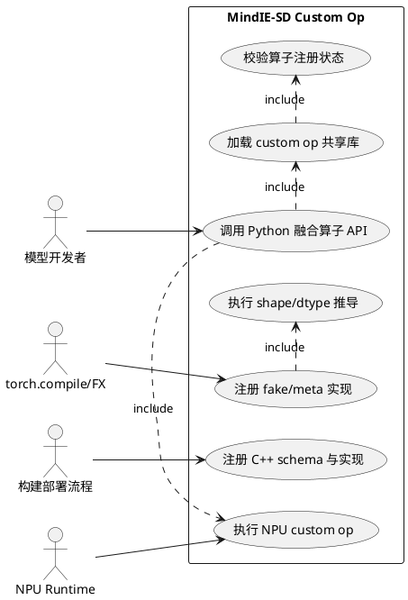
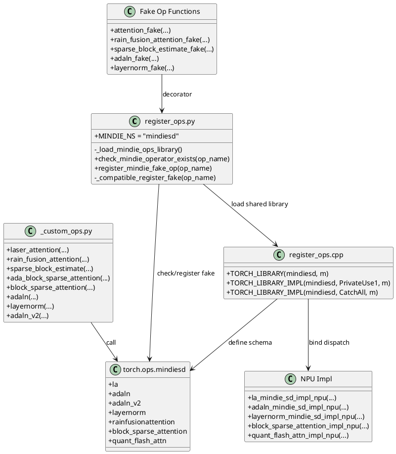
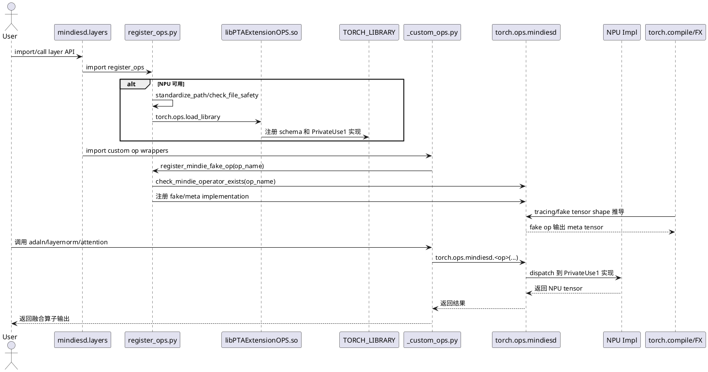

# Custom Op 设计说明书

## 需求背景

MindIE-SD 在扩散模型推理中包含注意力、归一化、位置编码、稀疏计算、量化注意力等高频计算路径。直接使用 PyTorch 原生算子组合会带来较多 kernel 启动、显存读写和动态图调度开销，难以充分发挥昇腾 NPU 的融合计算能力。

Custom Op 模块通过 C++/NPU 插件和 Python 封装，将昇腾侧高性能算子注册到 `torch.ops.mindiesd` 命名空间，并在 `mindiesd.layers` 中提供稳定的 Python API。该设计使上层模型可以用普通 Python 函数调用融合算子，同时保留 `torch.compile` 所需的 fake/meta 实现能力。

## 设计目标

- 通过 `torch.ops.mindiesd` 统一承载 MindIE-SD 自定义算子。
- Python 层提供轻量封装，屏蔽 C++ 注册名、默认参数和返回值细节。
- C++ 层负责 schema 注册和 NPU dispatch，实现 PyTorch 与昇腾算子实现之间的桥接。
- fake op 覆盖输出 shape/dtype 推导，支撑 `torch.compile`、FX tracing 和 pattern replacement。
- 动态加载共享库前执行路径和权限校验，降低插件加载风险。
- CPU 环境保持导入兼容，NPU 环境启用真实 custom op 注册与 fake op 注册。

## 总体方案

Custom Op 链路分为四层：

| 层级 | 主要文件 | 职责 |
|------|----------|------|
| Python API 层 | `mindiesd/layers/*.py` | 面向模型代码提供函数或 Module 接口 |
| Python custom op 封装层 | `mindiesd/layers/_custom_ops.py` | 调用 `torch.ops.mindiesd.<op>`，定义 fake op |
| 注册与加载层 | `mindiesd/layers/register_ops.py` | 加载 `libPTAExtensionOPS.so`，检查算子是否存在，兼容不同 PyTorch fake 注册接口 |
| C++ 插件层 | `csrc/plugin/*.cpp`、`register_ops.cpp` | 通过 `TORCH_LIBRARY` 定义 schema，通过 `TORCH_LIBRARY_IMPL` 绑定 NPU 实现 |

运行时在 NPU 环境导入 `mindiesd.layers.register_ops` 时加载共享库。共享库加载完成后，`TORCH_LIBRARY(mindiesd, m)` 中定义的算子 schema 会进入 PyTorch dispatcher；随后 `_custom_ops.py` 中的 fake 函数通过 `register_mindie_fake_op` 绑定到同名算子，为编译期 shape 推导提供 meta 实现。

## 接口设计

Python 层通过封装函数调用 custom op：

```python
from mindiesd.layers._custom_ops import adaln, layernorm, rain_fusion_attention

out = adaln(x, scale, shift, weight=weight, bias=bias, epsilon=1e-5)
norm_out, mean, rstd = layernorm(x, normalized_shape=[hidden_size], weight=weight, bias=bias)
attn_out, softmax_lse = rain_fusion_attention(q, k, v, select_idx, select_num_idx, blockshape=[128, 128])
```

核心算子注册在 `mindiesd` 命名空间下：

| 算子 | Python 封装 | C++ schema | 说明 |
|------|-------------|------------|------|
| Laser Attention | `laser_attention` | `mindiesd::la` | 高性能注意力 |
| Laser Attention 预处理 | `laser_attention_preprocess` | `mindiesd::la_preprocess` | Q/K/V 对齐预处理 |
| RainFusion Attention | `rain_fusion_attention` | `mindiesd::rainfusionattention` | RainFusion 稀疏注意力 |
| 稀疏块估计 | `sparse_block_estimate` | `mindiesd::sparse_block_estimate` | 生成稀疏 mask 和 count table |
| 自适应块稀疏注意力 | `ada_block_sparse_attention` | `mindiesd::ada_block_sparse_attention` | Ada-BSA 注意力 |
| 块稀疏注意力 | `block_sparse_attention` | `mindiesd::block_sparse_attention` | 通用块稀疏注意力 |
| AdaLayerNorm | `adaln`、`adaln_v2` | `mindiesd::adaln`、`mindiesd::adaln_v2` | 自适应 LayerNorm |
| LayerNorm | `layernorm` | `mindiesd::layernorm` | 高性能 LayerNorm |
| 量化 Flash Attention | `quant_flash_attn` | `mindiesd::quant_flash_attn` | Q/K/V 量化注意力 |
| 量化 FA metadata | `quant_flash_attn_metadata` | `mindiesd::quant_flash_attn_metadata` | 量化注意力 metadata 构造 |

## 用例图

用例图描述 Custom Op 的功能边界。模型开发者使用 Python API 调用融合算子；编译系统依赖 fake op 完成图捕获和 shape 推导；构建/部署流程负责生成并安装共享库。NPU 环境执行真实算子，CPU 环境保留 Python 导入和部分 mock 测试能力。



## 类图

类图描述 Custom Op 的静态结构。`register_ops.py` 是 Python 侧加载与 fake 注册的中心；`_custom_ops.py` 中每个封装函数直接调用 `torch.ops.mindiesd`，每个 fake 函数通过装饰器绑定到相同 schema；C++ 插件通过 `TORCH_LIBRARY` 定义 schema，并通过 `TORCH_LIBRARY_IMPL(..., PrivateUse1, ...)` 绑定 NPU dispatch。



## 时序图

时序图描述从导入到执行 custom op 的关键流程。共享库只在 NPU 可用时加载；fake op 注册发生在 Python 模块加载阶段；模型前向执行时，Python 封装函数进入 PyTorch dispatcher，并由 `PrivateUse1` dispatch key 路由到 NPU 实现。



## 模块设计

### 注册与加载模块

`mindiesd/layers/register_ops.py` 负责 custom op 共享库加载和 fake op 注册。

- `_load_mindie_ops_library` 根据当前文件位置定位 `mindiesd/plugin/libPTAExtensionOPS.so`，并通过 `file_utils.standardize_path` 与 `check_file_safety` 完成路径和权限校验。
- `check_mindie_operator_exists` 通过 `getattr(torch.ops.mindiesd, op_name)` 检查 schema 是否已注册。
- `register_mindie_fake_op` 在 NPU 环境下校验算子存在后注册 fake 实现；非 NPU 环境返回 no-op decorator，保证 CPU 测试导入不因缺少 SO 失败。
- `_compatible_register_fake` 兼容 PyTorch 2.1 的 `Library.impl(..., "Meta")` 和 PyTorch 2.2+ 的 `torch.library.register_fake/impl_abstract`。

### Python 封装模块

`mindiesd/layers/_custom_ops.py` 负责定义 Python 调用接口和 fake 实现。封装函数只做轻量参数透传，不承载重计算逻辑；fake 函数根据输入 shape、dtype、layout 构造 `torch.empty` 或 `torch.empty_like` 输出，用于编译期 shape 推导。

该层不直接依赖具体 NPU kernel 文件，所有真实执行通过 `torch.ops.mindiesd` 进入 PyTorch dispatcher。

### C++ 插件模块

`csrc/plugin/register_ops.cpp` 定义 MindIE-SD custom op 的 PyTorch schema 和 dispatch 实现：

- `TORCH_LIBRARY(mindiesd, m)` 定义算子名、参数、默认值和返回值。
- `TORCH_LIBRARY_IMPL(mindiesd, PrivateUse1, m)` 将 schema 绑定到 NPU 实现函数。
- `TORCH_LIBRARY_IMPL(mindiesd, CatchAll, m)` 为 metadata 类算子提供不依赖 NPU tensor dispatch 的调用路径。

各算子的真实实现位于同目录的独立 `.cpp/.h` 文件中，注册文件只负责聚合 schema 和 dispatch 绑定。

## DFX 设计

### 可观测性

- fake op 注册前检查 `torch.ops.mindiesd` 中是否存在目标算子。
- 算子缺失时输出结构化 error 日志，包含命名空间、算子名、期望注册项、可能原因和排查方向。
- 编译场景中 fake op 输出 shape 与 dtype 与真实算子接口保持一致，便于 FX graph 打印和 pattern 调试。

### 可靠性

- 共享库加载前执行文件路径标准化和权限检查。
- NPU 不可用时跳过真实共享库加载和 fake 注册，保证 CPU 环境导入稳定。
- fake op 注册前校验真实 op 是否存在，避免编译期注册到不存在的 schema。
- PyTorch 2.1 与 2.2+ 使用兼容注册路径，降低版本差异带来的失败概率。

### 性能

- Python 封装层只做参数透传，运行时核心计算全部下沉到 NPU custom op。
- 高粒度融合算子减少 PyTorch 原生算子链中的 kernel 启动和中间 tensor 写回。
- fake op 只在 tracing/compile 阶段参与 shape 推导，不进入推理热路径。

### 可维护性

- 算子 schema 集中在 `register_ops.cpp`，Python 封装与 fake 实现集中在 `_custom_ops.py`。
- 每个算子的 C++ 实现以独立文件维护，避免注册逻辑与算法实现耦合。
- 新增算子遵循固定流程：C++ schema、NPU impl、Python wrapper、fake op、UT。

### 安全性

- 共享库路径由包内相对路径推导，不接受外部任意路径输入。
- 加载前校验二进制文件权限，降低加载异常或被篡改文件的风险。
- 错误日志不输出用户输入 tensor 内容，只输出算子名和路径/注册状态信息。

## UT 设计

### 注册模块 UT

注册模块 UT 覆盖共享库加载、算子存在性检查和 fake 注册分支。

| 用例 | 输入 | 预期 |
|------|------|------|
| NPU 不可用 | mock `is_npu_available=False` | 不加载 SO，decorator 原样返回函数 |
| 算子存在 | mock `torch.ops.mindiesd.<op>` 存在 | `check_mindie_operator_exists` 返回 True |
| 算子缺失 | mock `torch.ops.mindiesd.<op>` 抛 `AttributeError` | 返回 False |
| fake 注册缺失算子 | NPU 可用但目标 op 不存在 | 抛 `RuntimeError` 并记录 error 日志 |
| SO 权限异常 | mock `check_file_safety` 抛异常 | 加载流程中断并透出异常 |

### Python wrapper UT

Python wrapper UT 覆盖封装函数是否调用正确的 `torch.ops.mindiesd` 目标和参数名。

| 用例 | 输入 | 预期 |
|------|------|------|
| `adaln` wrapper | x/scale/shift/weight/bias | 调用 `torch.ops.mindiesd.adaln` |
| `layernorm` wrapper | input/normalized_shape/weight/bias | 调用 `torch.ops.mindiesd.layernorm` |
| attention wrapper | q/k/v 和布局参数 | 调用对应 attention custom op |
| sparse wrapper | sparse mask/count table | 参数透传完整 |

### Fake op UT

Fake op UT 覆盖 shape、dtype、layout 分支。

| 用例 | 输入 | 预期 |
|------|------|------|
| `attention_fake` | 4D query | 返回 `softmax_log_max_sum` 和 `output`，shape 与实现一致 |
| `attention_preprocess_fake` | 3D/4D q/k/v | 输出序列长度按 `align_len` 对齐 |
| `sparse_block_estimate_fake` | `BNSD` / `BSND` | sparse mask/count table shape 正确 |
| `layernorm_fake` | 任意输入 shape | 返回 output/mean/rstd |
| 非法 layout | 不支持的 layout | 抛出 `ParametersInvalid` |

### NPU 集成 UT

NPU 集成 UT 在真实 NPU 环境执行 custom op 小 shape 用例，覆盖输出 shape、dtype 和数值一致性。对可与 PyTorch 原生实现对齐的算子执行 golden 比较；对稀疏注意力类算子执行 shape/dtype、无异常和边界参数覆盖。

## 风险与约束

- custom op 依赖 `libPTAExtensionOPS.so` 和昇腾运行环境，CPU 环境只覆盖导入、mock 和 fake 逻辑。
- C++ schema 与 Python wrapper 参数必须保持一致，任一侧修改都需要同步更新 fake op 和 UT。
- fake op 只负责 shape/dtype 推导，不保证真实算子的数值正确性。
- 不同 PyTorch 版本 fake 注册 API 存在差异，版本升级需验证 `_compatible_register_fake`。
- `PrivateUse1` dispatch 依赖 torch_npu 设备注册，非昇腾设备不执行真实 custom op。

## 文件范围

| 文件 | 说明 |
|------|------|
| `mindiesd/layers/register_ops.py` | custom op 共享库加载、算子存在性检查、fake 注册兼容层 |
| `mindiesd/layers/_custom_ops.py` | custom op Python wrapper 和 fake 实现 |
| `mindiesd/layers/*.py` | 面向上层模型的融合算子 API |
| `csrc/plugin/register_ops.cpp` | PyTorch schema 和 dispatch 注册 |
| `csrc/plugin/*.cpp`、`csrc/plugin/*.h` | 各 custom op 的 NPU 实现 |
| `tests/plugin/*`、`tests/layers/*` | custom op 单测和集成测试 |
