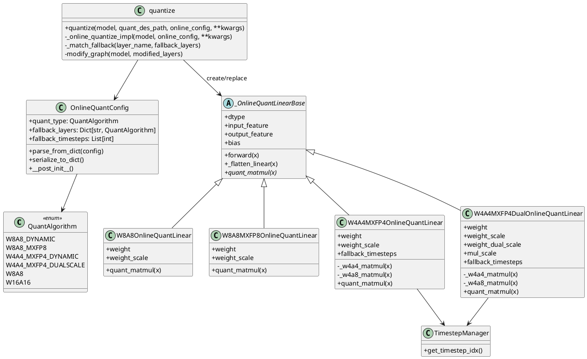
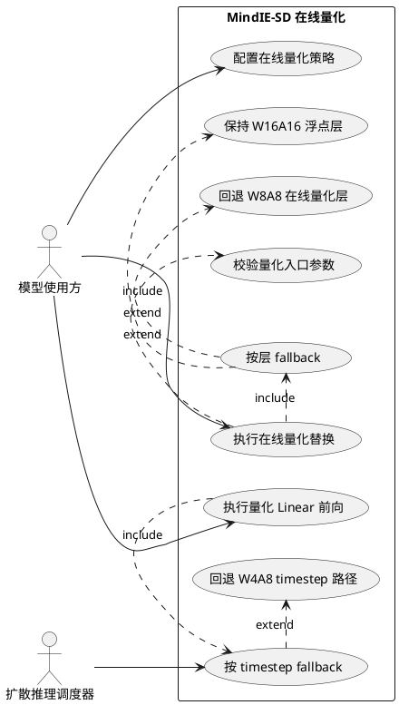
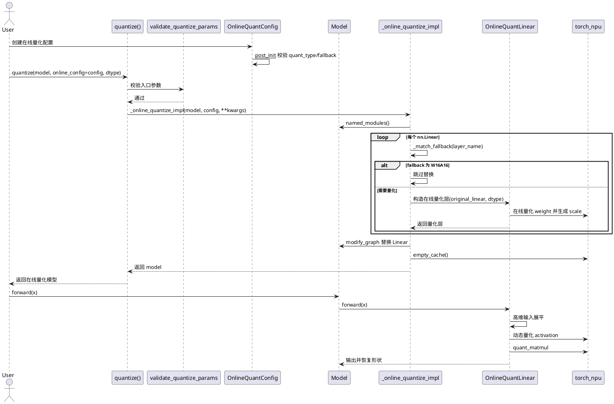

# 在线量化设计说明书

## 需求背景

当前 MindIE-SD 已支持基于 msModelSlim 导出描述文件和 safetensors 权重文件的离线量化。离线量化适合精度充分校准、量化权重预先生成的生产场景，但在模型快速验证、算法对比、不同量化策略试验时，需要先离线生成量化权重，调试链路较长。

本次修改新增在线量化能力，在模型加载后直接遍历 `nn.Linear` 层，并基于原始浮点权重在 NPU 上生成量化权重和 scale，再替换为在线量化 Linear 模块。该能力主要解决以下问题：

- 缩短量化验证链路，无需依赖外部量化描述文件即可完成图替换。
- 支持 W8A8 Dynamic、W8A8 MXFP8、W4A4 MXFP4、W4A4 MXFP4 DualScale 等在线量化策略。
- 支持按层 fallback，将指定层保持 W16A16 或回退到 W8A8。
- 支持 W4A4 在线量化在指定 timestep 回退到 W4A8，降低特定扩散步上的精度风险。

## 设计目标

- 复用现有 `quantize` 统一入口，避免新增独立公开接口。
- 保持离线量化行为兼容，`quant_des_path` 原有链路不改变。
- 在线量化配置显式化，参数校验前置，异常信息可定位。
- 在线量化模块对齐现有量化 Linear 的 forward 行为，支持高维输入展平后计算再恢复形状。
- 在线量化产生的中间权重和 scale 作为非持久 buffer，不污染模型持久化权重。

## 总体方案

`quantize` 新增 `online_config` 参数，并约束 `quant_des_path` 与 `online_config` 互斥：

- 传入 `quant_des_path` 时，继续执行原离线量化流程。
- 传入 `online_config` 时，执行 `_online_quantize_impl`，遍历模型中的 `nn.Linear`，根据主量化算法和 fallback 策略生成在线量化层，最后通过 `modify_graph` 统一替换。

在线配置由 `OnlineQuantConfig` 承载，主要字段如下：

| 字段 | 类型 | 说明 |
|------|------|------|
| `quant_type` | `QuantAlgorithm` | 主在线量化算法，支持 `W8A8_DYNAMIC`、`W8A8_MXFP8`、`W4A4_MXFP4_DYNAMIC`、`W4A4_MXFP4_DUALSCALE` |
| `fallback_layers` | `Dict[str, QuantAlgorithm]` | 基于 `fnmatch` 的层名匹配规则，支持将匹配层回退到 `W8A8` 或 `W16A16` |
| `fallback_timesteps` | `List[int]` | W4A4 在线量化专用，指定 timestep 使用 W4A8 路径 |

## 接口设计

### 使用示例

```python
import torch
from mindiesd.quantization.config import OnlineQuantConfig
from mindiesd.quantization.mode import QuantAlgorithm
from mindiesd.quantization.quantize import quantize

online_config = OnlineQuantConfig(
    quant_type=QuantAlgorithm.W4A4_MXFP4_DYNAMIC,
    fallback_layers={
        "transformer_blocks.*.attn.*": QuantAlgorithm.W8A8,
        "final_layer": QuantAlgorithm.W16A16,
    },
    fallback_timesteps=[0, 1, 2],
)

model = quantize(model, online_config=online_config, dtype=torch.bfloat16)
```

### 参数校验

`validate_quantize_params` 负责统一校验：

- `model` 必须是 `nn.Module`。
- `quant_des_path` 与 `online_config` 必须二选一，不能同时传入，也不能同时为空。
- `dtype` 仅支持 `torch.float16` 和 `torch.bfloat16`。
- 离线模式继续校验 `quant_des_path` 文件安全性、`timestep_config` 类型和自定义 `map` 类型。
- 在线模式校验 `online_config` 必须是 `OnlineQuantConfig`。

`OnlineQuantConfig.__post_init__` 负责在线量化配置自身校验：

- `quant_type` 必须属于 `SUPPORTED_ONLINE_QUANT_TYPES`。
- `fallback_layers` 的 key 必须是字符串，value 必须是 `SUPPORTED_ONLINE_FALLBACK_TYPES`。
- `fallback_timesteps` 仅允许在 W4A4 MXFP4 类在线量化中使用，元素必须为整数。

## 类图

类图描述在线量化的静态结构。设计上将配置、入口分发和具体量化层三类职责分开：`OnlineQuantConfig` 只承载在线量化策略和参数校验；`quantize` 负责在离线量化与在线量化之间分发，并完成模型图替换；各 `OnlineQuantLinear` 子类只关注对应量化算法的权重量化、激活量化和矩阵乘实现。

在线量化层统一继承 `_OnlineQuantLinearBase`，公共的 dtype、bias、输入展平和输出恢复逻辑在基类中实现，避免每种量化算法重复处理 shape 和基础属性。W4A4 MXFP4 两个实现额外依赖 `TimestepManager`，用于在 forward 阶段根据当前 timestep 选择 W4A4 或 W4A8 fallback 计算路径。



## 用例图

用例图描述在线量化能力对外呈现的功能边界。使用方通过统一的 `quantize` 接口触发量化，不直接感知具体在线量化层的构造细节。在线量化模式包含配置校验、Linear 层替换、按层 fallback、按 timestep fallback 和推理执行五类核心用例；其中按 timestep fallback 仅属于 W4A4 MXFP4 在线量化路径，按层 fallback 则作用于模型替换阶段。



## 时序图

时序图描述在线量化从接口调用到推理前向的关键交互顺序。模型替换阶段只执行一次权重量化和图替换；推理阶段每次 forward 动态量化 activation，并复用构造阶段注册的量化权重和 scale。该设计将一次性模型改图开销与多次推理计算解耦，避免在每次推理中重复生成量化权重。



## 模块设计

### OnlineQuantConfig

`OnlineQuantConfig` 位于 `mindiesd/quantization/config.py`，用于描述在线量化策略。相比离线量化配置，它不描述每层权重文件路径，而是描述运行期如何从浮点 Linear 生成量化 Linear。

配置支持字典解析和序列化，便于后续从 JSON/YAML 或服务配置中接入。

### 在线量化层基类

`_OnlineQuantLinearBase` 位于 `mindiesd/quantization/layer.py`，封装在线量化 Linear 的公共行为：

- 保存 `dtype`、输入输出特征数和 bias。
- 将 bias 注册为非持久 buffer。
- `forward` 中对三维及以上输入展平，量化矩阵乘后恢复原形状。
- 通过抽象方法 `quant_matmul` 交给具体算法实现。

### W8A8OnlineQuantLinear

构造阶段：

- 将原始 `nn.Linear.weight` 搬到 NPU 并转为目标 `dtype`。
- 调用 `torch_npu.npu_dynamic_quant` 生成 int8 权重和 `weight_scale`。
- 权重转置并连续化，以匹配 `npu_quant_matmul` 输入要求。

前向阶段：

- 对 activation 调用 `npu_dynamic_quant` 生成 int8 输入和 per-token scale。
- 调用 `npu_quant_matmul` 完成 W8A8 动态量化矩阵乘。

### W8A8MXFP8OnlineQuantLinear

构造阶段使用 `npu_dynamic_mx_quant(..., dst_type=torch_npu.float8_e4m3fn)` 生成 MXFP8 权重和 scale。前向阶段对 activation 执行同类 MXFP8 动态量化，并通过 `npu_quant_matmul` 指定 `scale_dtype`、`pertoken_scale_dtype` 和 `group_sizes=[1, 1, 32]`。

### W4A4MXFP4OnlineQuantLinear

构造阶段使用 `npu_dynamic_mx_quant` 生成 MXFP4 权重和 scale。前向阶段有两条路径：

- 默认路径 `_w4a4_matmul`：activation 和 weight 均使用 FP4 量化。
- fallback 路径 `_w4a8_matmul`：指定 timestep 下 activation 使用 int8 动态量化，weight 保持 FP4，即 W4A8。

是否 fallback 由 `TimestepManager.get_timestep_idx()` 和 `fallback_timesteps` 共同决定。

### W4A4MXFP4DualOnlineQuantLinear

构造阶段使用 `npu_dynamic_dual_level_mx_quant` 生成 FP4 权重、L0 scale 和 L1 scale，并对权重做 NZ 格式转换。前向默认调用 `npu_dual_level_quant_matmul`，指定 timestep 下回退到 W4A8 路径。

## Fallback 策略

### 按层 fallback

`fallback_layers` 使用 `fnmatch` 匹配层名，按配置字典迭代顺序返回第一个命中的算法。

支持策略：

| fallback 算法 | 行为 |
|---------------|------|
| `W16A16` | 保持原始 `nn.Linear`，不做在线量化替换 |
| `W8A8` | 使用 `W8A8OnlineQuantLinear` 替换该层 |

### 按 timestep fallback

`fallback_timesteps` 仅对 W4A4 MXFP4 在线量化生效。推理前由外部设置 `TimestepManager` 当前 timestep，量化层在 forward 中读取当前 timestep：

- 当前 timestep 命中 fallback 集合时，使用 W4A8 路径。
- 未命中或 timestep 为空时，使用 W4A4 路径。

## DFX 设计

### 可观测性

- 在线量化开始时通过 info 日志记录 `quant_type`、`fallback_layers`、`fallback_timesteps`。
- 每个被替换的层通过 debug 日志记录层名、算法和量化类。
- `W16A16` fallback 层通过 debug 日志记录跳过替换。
- 在线量化结束时通过 info 日志记录替换层数量。

### 可靠性

- 入口校验保证离线/在线模式互斥，避免同时读取离线权重又执行在线量化。
- 配置构造时校验算法支持范围，避免运行到中途才暴露不支持算法。
- fallback 算法白名单限制为 `W8A8` 和 `W16A16`，降低复杂组合带来的不可控风险。
- W4A4 timestep fallback 限定只在 W4A4 类型启用，避免对 W8A8/MXFP8 产生语义歧义。

### 性能

- 在线量化只在模型替换阶段对权重做一次量化，前向阶段复用已注册的量化权重和 scale。
- 高维输入先展平为二维再调用 NPU 量化 matmul，减少动态场景三维算子性能劣化。
- 替换完成后调用 `torch.npu.empty_cache()`，释放临时量化过程中的缓存。

### 可维护性

- 在线量化类继承统一基类，公共的 bias、dtype、shape 处理逻辑集中维护。
- `_ONLINE_QUANT_LAYER_MAP` 集中维护算法到量化类的映射，新增算法时修改点明确。
- 在线配置支持 `parse_from_dict` 和 `serialize_to_dict`，便于后续纳入配置文件或服务化参数。

### 安全性

- 在线模式不读取外部权重文件，减少文件路径和模型数据文件校验面。
- 离线模式保留既有 `file_utils.standardize_path` 与 `check_file_safety` 校验。
- 量化权重和 scale 使用 `persistent=False` 的 buffer，避免误保存中间量化结果。

## UT 设计

### 配置类 UT

配置类 UT 覆盖 `OnlineQuantConfig` 的默认构造、字典解析、序列化和非法参数校验，测试文件为 `tests/quantization/test_config.py`。

| 用例 | 输入 | 预期 |
|------|------|------|
| 默认构造 | `OnlineQuantConfig()` | `quant_type` 为 `W8A8_DYNAMIC`，`fallback_layers` 为空字典 |
| 字典解析 | 字符串形式 `quant_type` 和 `fallback_layers` | 自动转换为 `QuantAlgorithm` |
| 序列化 | 含 fallback 的配置 | 输出算法值为字符串 |
| 非法主算法 | `quant_type=QuantAlgorithm.W8A8` | 抛出 `ModelInitError` |
| 非法 fallback key | key 非字符串 | 抛出 `ModelInitError` |
| 非法 fallback value | value 不在 `W8A8/W16A16` | 抛出 `ModelInitError` |
| 非法 timestep 算法 | W8A8 配置 `fallback_timesteps` | 抛出 `ModelInitError` |
| 非法 timestep 元素 | timestep 包含非 int | 抛出 `ModelInitError` |

### quantize 入口 UT

`quantize` 入口 UT 覆盖在线/离线模式互斥、参数类型校验、fallback 匹配和图替换分支，测试文件为 `tests/quantization/test_quantize.py`。

| 用例 | 输入 | 预期 |
|------|------|------|
| 在线离线互斥 | 同时传 `quant_des_path` 和 `online_config` | 抛出 `ParametersInvalid` |
| 参数缺失 | 两者都不传 | 抛出 `ParametersInvalid` |
| online_config 类型错误 | 传入普通 dict | 抛出 `ParametersInvalid` |
| dtype 错误 | `dtype=torch.float32` | 抛出 `ParametersInvalid` |
| fallback 匹配 | `_match_fallback("a.b.c", {"a.*": W8A8})` | 返回 `W8A8` |
| fallback 不匹配 | `_match_fallback("x.y", {"a.*": W8A8})` | 返回 `None` |
| W16A16 跳过 | 模型层名命中 W16A16 | 原 `nn.Linear` 保持不变 |

### 在线量化层 UT

在线量化层依赖 NPU 算子，UT 按项目现有 `MINDIE_TEST_MODE` 机制区分 CPU/NPU 覆盖范围：

- CPU 兼容用例：通过 mock `torch_npu` 相关接口，验证构造函数调用、buffer 注册、forward 展平恢复形状逻辑。
- NPU 用例：在支持设备上创建小尺寸 `nn.Linear`，分别覆盖 W8A8、MXFP8、W4A4、DualScale 的构造和 forward。
- timestep fallback 用例：mock 或设置 `TimestepManager.get_timestep_idx()`，验证命中 fallback 时调用 `_w4a8_matmul`，未命中时调用 `_w4a4_matmul`。

核心断言项如下：

- 替换后层类型符合 `_ONLINE_QUANT_LAYER_MAP`。
- `weight`、`weight_scale`、`weight_dual_scale` 等 buffer 存在且 `persistent=False`。
- 输入 shape 为 `[B, S, H]` 时输出 shape 为 `[B, S, O]`。
- bias 存在时前向前会按算子要求转换到 `float32`。

### 回归测试

- 离线量化路径：保留现有 `quant_des_path` mock 用例，确保新增参数不改变原行为。
- 兼容性：原有 `quantize(model, quant_des_path)` 调用方式仍可使用。
- 异常路径：覆盖配置非法、fallback 算法非法、dtype 非法、模式互斥等错误分支。

## 风险与约束

- 在线量化依赖 `torch_npu` 动态量化和量化 matmul 算子，CPU 环境只能做 mock 级单测。
- W4A4/MXFP4 算法对硬件和 torch_npu 版本有要求，需在目标 NPU 环境做集成验证。
- 当前在线量化只自动处理 `nn.Linear`，自定义 Linear 子类不在本次设计范围内。
- `fallback_layers` 使用通配符匹配层名，配置顺序会影响命中结果，更具体的规则位于更高优先级位置。
- `W4A4MXFP4DualOnlineQuantLinear._w4a8_matmul` 当前复用 FP4 权重 buffer，需在 NPU 实测中重点验证该 fallback 路径的算子入参兼容性和精度表现。

## 文件修改范围

| 文件 | 说明 |
|------|------|
| `mindiesd/quantization/config.py` | 新增在线量化配置、支持算法白名单和配置校验 |
| `mindiesd/quantization/mode.py` | 新增 `W4A8`、`W16A16` 枚举，用于 fallback 语义 |
| `mindiesd/quantization/layer.py` | 新增在线量化 Linear 基类和 W8A8/MXFP8/W4A4/DualScale 实现 |
| `mindiesd/quantization/quantize.py` | 扩展 `quantize` 入口，新增在线量化分发、fallback 匹配和图替换 |
| `.gitignore` | 忽略构建产物和 `fusion_result.json` |
