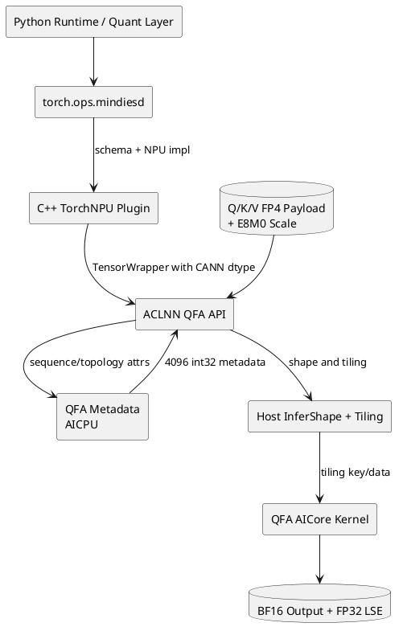
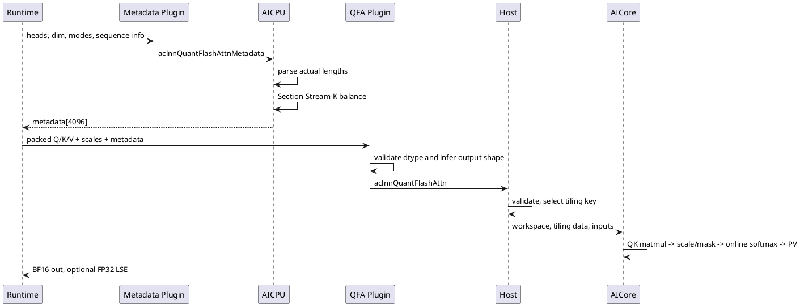
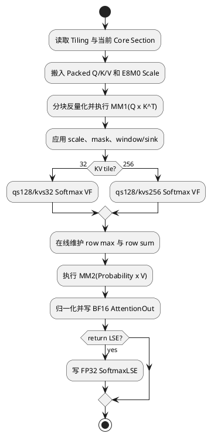

# MXFP4 Quant Flash Attention 设计说明书

## 1. 文档概述

本文描述 MindIE-SD 在 Ascend 上实现 MXFP4 Quant Flash Attention（QFA）及其 Metadata 算子的设计。该特性由本人负责设计与交付，核心证据包括：

| PR | 内容 | 规模 | 合入时间 |
|---|---|---:|---|
| [!313](https://gitcode.com/Ascend/MindIE-SD/merge_requests/313) | 新增 QFA 与 QFA Metadata 双算子 | 88 文件，17711 行新增 | 2026-06-03 |
| [!347](https://gitcode.com/Ascend/MindIE-SD/merge_requests/347) | 新增 qs128/kvs32、qs128/kvs256 Softmax 变体 | 14 文件，909 行新增 | 2026-06-11 |
| [!365](https://gitcode.com/Ascend/MindIE-SD/merge_requests/365) | 接入部署端 MXFP4 FA 运行时配置 | 7 文件，859 行新增 | 2026-06-15 |

对应主仓实现提交为 `6c9f080`、`0c5670c`、`f1b15b4`。本文聚焦 QFA 双算子，不重复现有《在线量化设计说明书》中的 Linear 在线量化内容。

## 2. 需求背景

长序列多模态生成中，Attention 的 QK 矩阵乘、Softmax 与 PV 矩阵乘占据大量算力和带宽。仅在线量化 Linear 层不能消除 Attention 内部 BF16 数据搬运。MXFP4 将 Q/K/V 以分块 FP4 Payload 和 E8M0 Scale 表示，使算子可直接消费量化输入，在核内完成反量化、矩阵计算和 Softmax 流水。

变长序列、GQA、不同 Layout 和多核负载均衡又要求运行前生成结构化 Metadata，因此设计拆分为控制面 Metadata AICPU 算子和数据面 QFA AICore 算子。

## 3. 设计目标

- 提供 PyTorch `torch.ops.mindiesd` 统一入口，屏蔽 ACLNN 调用细节。
- 支持 MXFP4 Packed Payload、E8M0 Descale、BF16 输出与可选 FP32 LSE。
- 支持 TND/BSND/BNSD Layout、变长序列、GQA、Mask 与窗口参数。
- Metadata 独立计算 Section-Stream-K 调度结果，数据面复用。
- 通过 qs128/kvs32 与 qs128/kvs256 专用 VF 路径适配不同 KV 长度形态。
- 构建、注册、Host Tiling、AICPU、AICore 与精度 Golden 形成完整交付链。

非目标：通用训练反向算子、运行时自动选择所有量化格式、在不支持的 SoC 上静默回退。

## 4. 分层架构



## 5. 公共接口

### 5.1 Quant Flash Attention

```python
out, lse = torch.ops.mindiesd.quant_flash_attn(
    query, key, value,
    q_descale, k_descale, v_descale,
    q_quant_mode, k_quant_mode, v_quant_mode,
    metadata=metadata,
    quant_block_size_qs=128,
    quant_block_size_ks=256,
    quant_block_size_vs=256,
    layout_q="BSND", layout_kv="BSND", layout_out="BSND",
    return_softmax_lse=0,
)
```

关键可选输入包括 `block_table`、`cu_seqlens_q/kv`、`seqused_q/kv`、`sinks`、`attn_mask` 和 Metadata；属性包括 Softmax Scale、Mask Mode、窗口、最大序列长度、Layout 与精度模式。

### 5.2 Metadata

`quant_flash_attn_metadata` 接收 Head 数、Head Dim、量化模式及序列信息，输出固定容量 4096 个 `int32` 的调度 Metadata。Batch Size 可显式传入，也可由 `cu_seqlens_q` 或 `seqused_q` 推导。

### 5.3 Packed Dtype 适配

PyTorch 2.1 等版本缺少部分 FP4/E8M0 枚举。Plugin 允许 Payload/Scale 以 `uint8` 原始字节承载，同时要求调用者传入 CANN Dtype Tag；`MakeTensorWrapper` 在 ACLNN 边界恢复真实语义。错误 Dtype 组合在进入算子前由 `TORCH_CHECK` 拒绝。

## 6. 执行时序



## 7. Metadata 与负载均衡

AICPU `Prepare` 解析 Layout、SoC Core 数、量化模式、Head 配置、窗口和实际序列长度。TND/NTD 使用累积序列；非累积 Layout 优先读取 `seqused`，否则由 `cu_seqlens` 计算每 Batch 长度。随后以 `mBaseSize=128`、`s2BaseSize=256` 构造 Section-Stream-K 参数，生成数据面调度表。

把 Metadata 从 AICore Kernel 分离有三点价值：复杂变长调度不占用数据面 Kernel；同一输入配置可复用；Host 与 Kernel 之间形成稳定二进制契约。

## 8. AICore Kernel 设计



Cube 路径负责矩阵乘，Vector 路径负责 Descale、Mask、Softmax 状态更新和输出归一化。不同 VF 变体避免短 KV Tile 在通用 256 路径上的浪费，并通过公共定义保持 Scale、索引和 Buffer 契约一致。

## 9. Host 与 Plugin 设计

- Torch Library 同时注册 Schema 和 NPU 实现，Python 无需直接依赖 ACLNN C 接口。
- Plugin 根据 Layout 推导输出 Shape；FP4 Packed Head Dim 按 Dtype Ratio 还原。
- LSE 未请求时输出 Shape 为 `[0]`，请求时按 Layout 返回 `[B,N,S]` 或变长等价结构。
- Host InferShape、Tiling Parser 和 Tiling Key 将输入组合映射到可编译模板。
- Build 脚本同时纳入 AICore 与 AICPU 产物，安装后由统一自定义算子注册机制加载。

## 10. DFX 设计

- 可靠性：Payload/Scale Dtype Tag、Layout、序列长度、Head 关系和量化 Block 必须在 Host/Plugin 层校验。
- 可观测性：Golden 工具输出误差位置、最大相对误差、Shape 与模式；建议追加 Tiling Key 和 Core 分配日志。
- 性能：Metadata 与计算解耦，专用 VF 变体提升短 KV 利用率；核心指标为 Kernel 时延、带宽与 AIC/AIV 利用率。
- 可维护性：公共 MemCopy、Load Balance、Tiling Base 下沉到 `csrc/ops/common`，避免每个 FA 变体复制基础设施。
- 安全性：所有长度和 Metadata Offset 必须在写入前校验，避免越界；Packed 字节只能结合显式 Dtype Tag 解释。

## 11. 测试设计

| 类别 | 覆盖内容 |
|---|---|
| CPU Golden | 高精度 Attention/Flash Attention 参考计算 |
| 量化工具 | MXFP4 Pack、Block Scale、E8M0 表示 |
| Shape/Layout | TND、BSND、BNSD，定长与变长 |
| Kernel 变体 | qs128/kvs32、qs128/kvs256，GQA 与不同 Head Dim |
| Mask | 无 Mask、窗口、实际序列长度、边界 Tile |
| 输出 | BF16 AttentionOut 与可选 FP32 LSE |
| 构建 | AICore、AICPU、Plugin、注册和 Wheel 安装链 |
| 模型 E2E | Wan2.2 精度、性能及在线量化配置联动 |

## 12. 风险与约束

- MXFP4 精度依赖 Block Size、Scale 生成和输入分布，必须以模型质量门而非单一误差阈值验收。
- AICPU Metadata 与 AICore Parser 是二进制契约，字段或固定容量变更必须同步版本化。
- Packed `uint8` 的真实 Dtype 由附加 Tag 决定，错配会产生静默数值错误，因此禁止猜测。
- 特性依赖目标 SoC、CANN 与 TorchNPU 组合；不支持的平台应显式报错或由更上层选择 BF16 FA。
- 该算子代码量大且模板多，新增 Layout/量化模式时需控制组合爆炸。

## 13. 关键文件

- `csrc/plugin/quant_flash_attn*.cpp`：TorchNPU 入口与 Dtype Adapter。
- `csrc/ops/quant_flash_attn/op_host/`：InferShape、Tiling 与模板选择。
- `csrc/ops/quant_flash_attn/op_kernel/`：AICore Cube/Vector Kernel。
- `csrc/ops/quant_flash_attn_metadata/`：Metadata Graph、Host 与 AICPU Kernel。
- `csrc/ops/common/`：负载均衡、MemCopy 和 Tiling 公共能力。
- `tests/ops/quant_flash_attn/`：量化、CPU Golden 与精度验证。
- `mindiesd/quantization/`：部署端 MXFP4 FA 配置接入。
