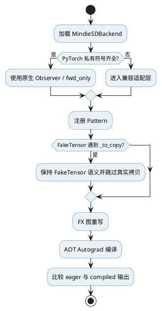
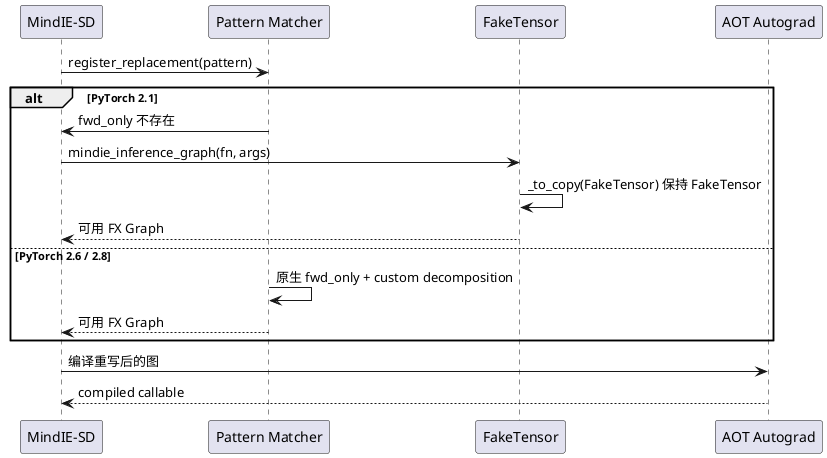

# PyTorch Compile 跨版本兼容问题定位文档

| 项目 | 内容 |
|---|---|
| 问题类型 | 框架私有接口兼容、FakeTensor 图捕获、算子注册差异 |
| 关联 Issue | [Issue #23：兼容性提升，支持新 CANN 和 PyTorch](https://gitcode.com/Ascend/MindIE-SD/issues/23) |
| 主要修复 PR | [PR !47：增加 compile 兼容性](https://gitcode.com/Ascend/MindIE-SD/merge_requests/47)、[PR !114：torch 兼容性提升](https://gitcode.com/Ascend/MindIE-SD/merge_requests/114) |
| 合入提交 | `290ac5d4fda23fd976cc0872303917bf74835aae`、`6ea7591d11fbe0c3ee21771999df2464abd4836d` |
| 责任范围 | PR 创建者为 `weixin_44144262`；Issue #23 的指派人包含该账号 |
| 结论 | 将直接绑定 PyTorch 2.8 私有接口的实现改造成版本适配层，并为 PyTorch 2.1 的 FakeTensor `_to_copy` 路径提供安全分解逻辑 |

## 1. 问题摘要

MindIE-SD 使用 `torch.compile`、FX Graph 和 Inductor pattern matcher 自动完成计算图模式替换。初始实现直接依赖 PyTorch 2.8 的内部符号和调用约定，因此在 PyTorch 2.1、2.6 等版本会在模块导入、PatternMatcherPass 构造、pattern tracing 或 AOT Autograd 阶段失败。

问题不是单个 API 缺失，而是同一条编译链上多处私有接口同时漂移：

- `GraphTransformObserver` 和 `decompose_auto_functionalized` 在低版本不存在或位置不同。
- `PatternMatcherPass` 的 `pass_name` 参数并非所有版本都支持。
- `torch._inductor.pattern_matcher.fwd_only` 在 PyTorch 2.1 不存在。
- PyTorch 2.1 在 pattern tracing 时遇到 FakeTensor `_to_copy`，可能触发不应发生的真实拷贝或分解错误。
- 自定义算子 Fake 实现的注册入口在 2.1 与较高版本之间不同。

## 2. 现象与影响

典型现象可按发生阶段归类：

| 阶段 | 现象 | 影响 |
|---|---|---|
| 导入阶段 | 私有模块或符号 `ImportError` | MindIE-SD compile 后端无法加载 |
| Pass 初始化 | `PatternMatcherPass(pass_name=...)` 参数不兼容 | 图优化流程无法启动 |
| Pattern tracing | FakeTensor 经 `_to_copy` 分解时报错 | 新增 pattern 无法注册或复制 |
| 自定义算子注册 | Fake/Meta 注册入口和参数签名不一致 | 注册单测或模型 compile 失败 |
| 回归阶段 | 低版本缺少 RMSNorm 等符号 | 与版本能力无关的用例误失败 |

## 3. 定位过程

### 3.1 先区分业务算子错误与框架入口错误

故障发生在模型真正执行前，调用栈集中在 `torch._inductor`、FX tracing 和自定义算子注册，因此先排除模型权重、输入数据和 NPU kernel 本身。将最小 compile 用例放到多个 PyTorch 版本执行后，可观察到错误点随版本改变，说明根因是框架内部 API 漂移。

### 3.2 对照私有接口能力矩阵

PR !47 将缺失能力逐项隔离：导入失败使用 fallback，构造参数差异使用 `TypeError` 分支，缺失 `fwd_only` 时补充替代实现。PR !114 继续定位 PyTorch 2.1 的 FakeTensor 问题，发现不能简单复用低版本 `inference_graph`，需要控制 `_to_copy` 的分解语义。

### 3.3 验证注册路径差异

自定义算子 Fake 实现在 PyTorch 2.1 走 `torch.library.Library.impl(..., "Meta")`，较高版本走 `_native_register_fake`。测试若始终 mock 同一入口，会把正确实现误判为失败，因此单测也必须按版本选择注册路径。

## 4. 根因分析

根因是编译后端把 PyTorch 私有 API 当作稳定公共契约使用。私有接口在版本间既有“符号是否存在”的差异，也有“签名和语义”的差异。仅使用版本号跳过全部 compile 用例会掩盖真实兼容问题；仅捕获 `ImportError` 又无法覆盖构造参数和 FakeTensor 行为差异。

其中最隐蔽的故障是 `_to_copy`：FakeTensor 用于只推导 shape、dtype 和 device，不应触发真实数据移动。PyTorch 2.1 的原始 tracing 路径处理新增 pattern 时会经过该算子，导致 FakeTensor 语义被破坏。

## 5. 修复方案

### 5.1 建立最小兼容适配层

- `GraphTransformObserver` 缺失时提供只保留 `apply_gm_pass`、`apply_graph_pass` 的轻量实现。
- `decompose_auto_functionalized` 缺失时遍历 FX 节点，恢复可识别的原始算子并执行 `eliminate_dead_code`、`lint`。
- `PatternMatcherPass` 优先使用 `pass_name`，旧版本遇到 `TypeError` 时退化为无参构造。
- `PatternPrettyPrinter` 仅影响调试日志，缺失时跳过打印，不阻断主流程。

### 5.2 为 PyTorch 2.1 定制 tracing

`mindie_inference_graph` 使用 `make_fx` 和自定义 decomposition table。当 `_to_copy` 的输入是 FakeTensor 时直接返回输入，其余情况仍调用原始 ATen 算子，从而只收窄特殊处理范围。

### 5.3 按版本选择注册入口

测试与实现共同确认：2.1 使用 `_lib.impl` 的 Meta 注册路径，2.2 及以上使用 `_native_register_fake`。重复 pattern 注册被识别后跳过，避免全量测试或重复导入时产生伪故障。

## 6. 验证方法与结果

PR 记录的验证计划是在 PyTorch 2.1、2.6、2.8 上执行全量测试。可核实证据如下：

| 证据 | 结果 |
|---|---|
| PR !47 截图 | `Ran 268 tests in 347.579s`，结果 `OK` |
| PR !114 截图 | `Ran 261 tests in 264.789s`，结果 `OK` |
| PR !47 流水线 | 完成记录包含 377、379、393、412，最终带 `ci-pipeline-passed` 标签 |
| PR !114 流水线 | 完成记录包含 618、624、627，最终带 `ci-pipeline-passed` 标签 |
| 关键功能断言 | compile 前后输出 `torch.allclose`；pattern 用例同时检查输出相似度与调用路径 |

证据边界：截图能证明对应运行中 268/261 个用例通过；PyTorch 2.1、2.6、2.8 的完整逐版本控制台日志未直接展示在 PR 正文中，因此文档不将截图解读为逐版本独立报告。

## 7. 关键代码

- `mindiesd/compilation/mindie_sd_backend.py`：Observer、functionalized 分解和 AOT 编译入口兼容。
- `mindiesd/compilation/passes/pattern_match_pass.py`：PatternMatcher 构造、`fwd_only` 和 FakeTensor 分解兼容。
- `tests/compilation/test_backend.py`：取消只允许 PyTorch 2.8 的整体跳过，验证实际 compile 行为。
- `tests/compilation/patterns/test_rmsnorm_pattern.py`：仅对低版本确实缺失的能力做精确跳过。
- `tests/layers/test_register_ops.py`：按版本验证 Fake/Meta 注册路径。

## 8. 经验沉淀

1. 对框架私有 API 建立单点适配层，业务代码不得散落版本判断。
2. 兼容策略应按“能力是否存在”判断，版本号只作为无法探测语义时的补充。
3. FakeTensor、Meta kernel 和真实 NPU kernel 必须分别测试，避免 tracing 成功但运行失败。
4. 低版本不支持某个单一算子时，只跳过该用例，不能跳过整个 compile 测试集。
5. 版本矩阵验证应保留每个版本的独立日志和环境快照，便于后续复盘。
