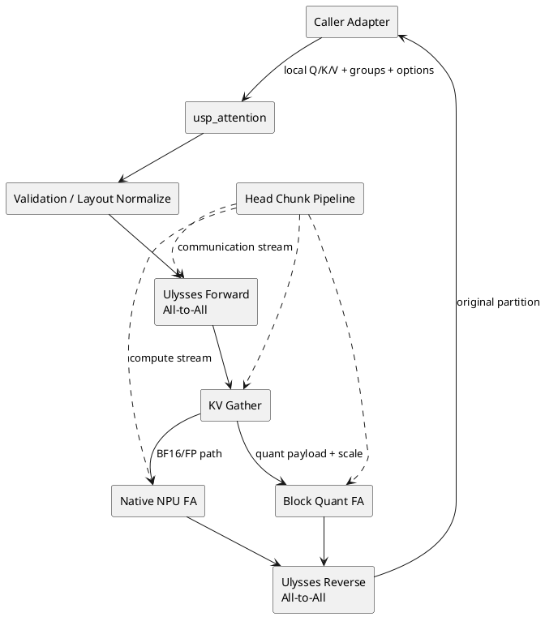
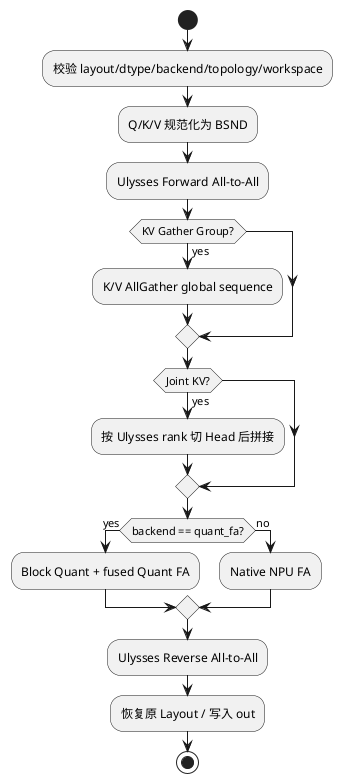
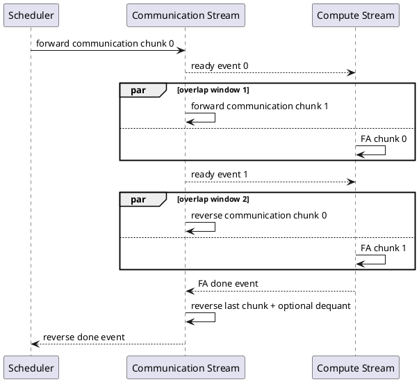

# USP 通信重叠与量化设计说明书

## 1. 文档概述

本文描述 MindIE-SD 统一序列并行注意力 `usp_attention` 的设计，包括 Ulysses Head/Sequence 交换、KV AllGather、通信量化、Quant FA 量化结果复用和多 Stream 重叠。该特性由本人负责设计与交付，对应 GitCode PR [!578](https://gitcode.com/Ascend/MindIE-SD/merge_requests/578)（904 行核心实现）及 [!580](https://gitcode.com/Ascend/MindIE-SD/merge_requests/580)（中英文指南与测试），均于 2026-09-03 合入；主仓提交为 `56a1400`、`6dc71e5`。

## 2. 需求背景

长视频和高分辨率生成使 Attention 序列急剧增长。Ulysses 通过 All-to-All 把本地序列分片换成完整序列与局部 Head，KV AllGather 则汇聚 K/V 序列。两者能扩展单卡容量，但通信会在短 Kernel、跨节点或多并行维组合时暴露。

本设计将 Q/K/V/Out 通信压缩、Head Chunk 流水与 FA 计算统一到一个显式接口，目标是减少传输字节并用计算覆盖剩余通信。PR 验证口径为 4/8 卡模型 E2E，典型多模态模型的不可掩盖通信目标缩小到 5% 以下；该数字是特定测试目标，不能脱离环境泛化。

## 3. 设计目标

- 单一接口组合 Ulysses、KV AllGather、Joint KV、FA 与反向交换。
- 调用方显式传入 Process Group，不在热路径推断拓扑或静默改策略。
- 支持 `none`、`fp8_e4m3`、`mxfp8` 通信 Dtype，并可选择量化 Q/K/V/Out。
- 通过 `comm_quant_scope=exposed` 只量化流水边界，减少不必要 Q/DQ。
- Quant FA 路径复用通信前 K/V Block Quant 结果，避免 Gather 后再次量化。
- 结构化异常覆盖不支持模式、拓扑、Shape 与 Workspace。

非目标：Ring Attention 的 KV 环传与 Partial Attention 合并、自动创建 Process Group、自动性能调优器。

## 4. 总体架构



## 5. 接口设计

```python
result = usp_attention(
    q, k, v,
    ulysses_group=ulysses_group,
    kv_gather_group=kv_group,
    layout="BSND",
    head_chunk_size=8,
    comm_dtype="fp8_e4m3",
    comm_tensors=("k", "v", "out"),
    comm_quant_scope="exposed",
    overlap=True,
    backend="quant_fa",
)
```

| 参数组 | 关键字段 | 语义 |
|---|---|---|
| 拓扑 | `ulysses_group`, `kv_gather_group` | 显式通信域；`None` 表示单 Rank |
| Layout | `BSND` / `BNSD` | 内部统一为 BSND，返回时恢复 |
| 分块 | `chunk_size`, `head_chunk_size` | Sequence Cut 或 Head Cut；前者不能与 Overlap 同开 |
| 通信量化 | `comm_dtype`, `comm_tensors`, `comm_quant_scope` | 格式、张量集合与量化范围 |
| FA | `auto`, `npu_fa`, `quant_fa` | 计算后端；LSE 当前仅 Quant FA |
| 扩展 | `joint_k/v`, `seq_lens`, `attn_mask` | Joint Attention、真实长度与 Mask |
| 内存 | `workspace`, `out`, `out_dtype` | 稳定工作区、预分配输出与目标类型 |

接口只接受规范化 Tensor、Group 和标量，不导入具体模型仓 Metadata 类型，使上游 vLLM-Omni、SGLang 或模型仓只需维护薄 Adapter。

## 6. 基本执行流程



KV AllGather 会物化完整 K/V 后执行一次本地 FA，因此它不是 Ring Attention。Joint KV 被视为各 Rank 已复制的数据，只按 Ulysses Head 切片，不再次 Gather。

## 7. 通信量化

`_block_quantize` 将通信张量按 Block 切分，计算 Scale 后转为 FP8 Payload；通信分别传输 Payload 与 Scale，接收端 `_block_dequantize` 恢复原 Shape/Dtype。`comm_tensors` 控制 Q/K/V/Out 中哪些参与量化。

在 `backend=quant_fa` 且 K/V 使用 `fp8_e4m3`、序列长度满足 Block 对齐时，K/V 在 AllGather 前执行 FA Block Quant，Gather Payload 与 Scale 后直接传给融合 QFA，避免“通信反量化 -> FA 再量化”。

## 8. Head Chunk 重叠流水



Head Cut 把 Q/K/V 按 Head 分块。通信 Stream 预处理下一 Chunk，计算 Stream 执行当前 FA，并用 Event 表达 Input Ready、FA Done 与 Reverse Done。`head_chunk_size` 必须可被 Ulysses World Size 整除且整除 Q Head；派生出的 KV Head Chunk 也必须满足整数映射。

`comm_quant_scope="exposed"` 仅量化第一个 Forward Chunk 和最后一个 Reverse Out Chunk，因为它们位于无法被相邻计算覆盖的流水边界；`all` 则量化全部选中通信。

## 9. 异常与契约

- `USPNotSupported`：不支持的 Backend、Dtype、参数组合或缺少 NPU Stream/Quant FA 能力。
- `USPTopologyError`：World Size、Head 切分、Group 映射不成立。
- `USPShapeError`：Q/K/V、Joint KV、Scale、Sequence Length 或 Layout 不一致。
- `USPWorkspaceError`：Workspace/Out Device、Dtype、容量不满足。

校验发生在首个 Collective 之前，减少 Rank 间不一致导致的 Hang。函数不会静默调整请求策略，Fallback 由上游 Adapter 统一决定。

## 10. DFX 设计

- 可观测性：建议记录标准化参数指纹、Group World Size、Chunk 数、通信字节、Quant Scope 与各阶段 Event 时间。
- 可靠性：首个 Collective 前完成拓扑与 Shape 校验；非等长序列使用 `seq_lens` 保存真实长度。
- 性能：优化目标是 Exposed Communication Time，不是 Collective 总时间；量化收益需扣除 Q/DQ 与 Scale 通信。
- 可维护性：通信、量化、FA Dispatch、Layout 和异常分层，公共接口不依赖模型类型。
- 安全性：预分配 Buffer 容量严格校验；不接受未知关键字，避免配置拼写被静默忽略。

## 11. 测试设计

| 测试项 | 验证点 |
|---|---|
| 单 Rank | 退化为本地 FA，Backend 与 Out Buffer 生效 |
| Layout | BNSD 输入可恢复原 Layout |
| Ulysses | Forward/Reverse 分片映射保持 |
| KV Gather | Rank 序列按正确顺序拼接 |
| 通信量化 | Payload 与 Scale 均参与 Collective，关闭时不量化 |
| Exposed Scope | 仅第一 Forward 与最后 Reverse Chunk 量化 |
| Quant FA 复用 | K/V Gather 前量化，FA 不重复量化 |
| Head Cut | 每个全局 Head Chunk 恰执行一次 Attention |
| 失败前置 | 非法拓扑在调用 Collective 前抛结构化异常 |
| 模型 E2E | HunyuanVideo 4/8 卡精度、性能和通信暴露比例 |

## 12. 风险与约束

- Overlap 在小 Shape 或慢 Q/DQ 下可能变慢，必须基于 Profile 决定是否开启。
- Group/Rank 配置不一致可能造成分布式 Hang；上游需对所有 Rank 生成相同配置。
- FP8/MXFP8 通信误差可能逐层放大，应支持按 Tensor、Block 或 Layer 关闭量化。
- Quant FA 复用要求 Block 对齐和兼容格式，不满足时走显式普通 Gather/FA 路径。
- 上游私有 Metadata 演进只能影响 Adapter，不应进入核心 API。
- `chunk_size` 与 Head Cut/Overlap 互斥，避免同时切两个维度导致调度组合爆炸。

## 13. 关键文件

- `mindiesd/layers/usp.py`：公共 API、Collective、量化、重叠流水与异常。
- `tests/layers/test_usp.py`：单 Rank、分片、量化、重叠、复用与异常测试。
- `docs/zh/features/usp.md`、`docs/en/features/usp.md`：接口、用例与集成说明。
- `mindiesd/layers/flash_attn/`：Native FA 与 Quant FA 后端。
