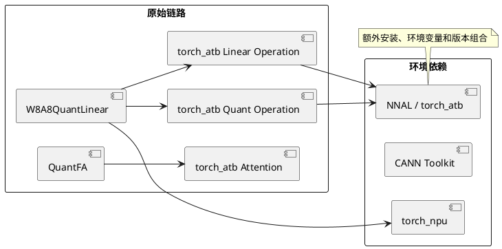
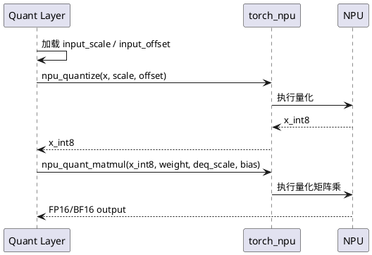

# 量化链路 ATB 依赖与旧 QuantFA 接口问题定位文档

| 项目 | 内容 |
|---|---|
| 问题类型 | 运行时依赖耦合、量化算子替换、无收益接口下线 |
| 关联 Issue | [Issue #23：兼容性提升，支持新 CANN 和 PyTorch](https://gitcode.com/Ascend/MindIE-SD/issues/23) |
| 修复 PR | [PR !92：使用 torch_npu 替换 ATB，移除未使用的 QuantFA 接口](https://gitcode.com/Ascend/MindIE-SD/merge_requests/92) |
| 合入提交 | `26bd179419d38a90c81c8810af6e15b4065e2207` |
| 变更规模 | 20 行新增、407 行删除、7 个文件 |
| 结论 | W8A8 静态量化可直接使用 torch_npu 等价算子，旧 QuantFA 无收益且无等价替换路径，应从 API、实现、测试和文档同时下线 |

## 1. 问题摘要

原量化实现通过 `torch_atb.Operation` 构造逐通道量化和 Linear 操作。用户即使只使用常规 W8A8 量化，也必须额外安装 CANN NNAL 的 torch_atb 组件并加载环境。该依赖扩大了安装组合，且把量化层绑定到 ATB 参数对象和执行接口。

与此同时，旧 `QuantFA` 路径在当时没有性能收益，也没有可直接替换的 torch_npu 算子。继续保留会形成一个对外可见、依赖沉重、收益不足的接口。

## 2. 现象与影响

- 环境未安装 `torch_atb` 时，量化层初始化直接抛出 `ModelInitError`。
- 安装说明要求额外执行 NNAL 安装并带 `--torch_atb`，部署复杂度高。
- 相同量化语义同时依赖 torch_npu 与 torch_atb，版本组合和故障面扩大。
- `QuantFA` 被从顶层 `mindiesd` 导出，用户可能依赖一个实际收益不足的接口。
- 测试通过 mock ATB Operation 验证实现细节，无法充分代表真实 torch_npu 执行路径。

## 3. 定位过程

### 3.1 从导入失败追踪到构造阶段

沿 W8A8 静态量化初始化路径检查，`_init_static_quant_param` 会无条件调用 `import_atb()`，随后创建 Quant 和 Linear 两个 ATB Operation。故障与模型输入无关，在权重装载阶段已经发生。

### 3.2 对照算子语义

ATB 路径实际完成两步：输入按 scale/offset 量化为 INT8，然后进行带 bias 和 dequant scale 的量化矩阵乘。torch_npu 已提供 `npu_quantize` 和 `npu_quant_matmul`，可以覆盖相同主流程，因此无需保留双运行时。

### 3.3 评估 QuantFA 去留

PR 说明明确记录“当代量化 FA 没有收益且无 torch_npu 替换算子”。如果只删除内部实现但保留导出和文档，会形成悬空 API；因此需要同步检查顶层导出、量化分发、测试和用户文档。

## 4. 根因分析

根因不是 torch_atb 自身不可用，而是依赖边界设计不合理：基础量化能力选择了更重的 ATB Operation 抽象，即使 torch_npu 已能提供等价能力仍强制加载 NNAL。旧 QuantFA 又通过顶层 API 暴露，造成实现收益与维护成本不匹配。

这类问题通常表现为“安装报错”，但真正需要处理的是依赖架构，而不是继续在安装脚本中补环境变量。

## 5. 修复方案

### 5.1 替换 W8A8 执行路径

- 删除 `import_atb()` 和 ATB Operation 初始化。
- 使用 `torch_npu.npu_quantize` 执行输入量化。
- 使用 `torch_npu.npu_quant_matmul` 执行矩阵乘、bias 和反量化。
- 保持静态、动态和时间步量化分支的输入输出契约。

### 5.2 完整下线旧 QuantFA

- 从 `mindiesd.__all__`、`mindiesd.quantization` 中移除 `QuantFA`。
- 删除 `QuantFA` 类和 `add_fa3` 分发逻辑。
- 删除对应 ATB mock 测试。
- 删除用户文档中手动修改 attention forward 的旧接入说明。

### 5.3 同步部署文档

移除“量化必须安装 NNAL torch_atb”的说明，使安装契约与代码实际依赖一致。

## 6. 验证方法与结果

| 验证项 | PR 记录 |
|---|---|
| 量化单元测试 | PR Test Plan 为 UT 测试 |
| 覆盖率截图 | `layer.py` 80%、`quantize.py` 82%、`config.py` 87%、`mode.py` 98%、`utils.py` 82% |
| 流水线 | 完成记录包含 554、564；最终带 `ci-pipeline-passed` 标签 |
| Issue 闭环 | Issue #23 的关闭评论明确列出 PR !92 为落地 PR 之一 |

建议复现验证矩阵：

1. 在未安装 torch_atb、已安装 torch_npu 的环境导入 `mindiesd`。
2. 分别运行 W8A8 静态、动态、时间步量化用例。
3. 对比替换前后输出 shape、dtype 和数值误差。
4. 检查 `from mindiesd import QuantFA` 不再作为支持接口，并核对迁移说明。
5. 执行量化全量 UT 和端到端模型冒烟。

证据边界：PR 截图提供覆盖率摘要而非端到端模型精度数据，因此文档只确认 UT 和流水线通过，不推导具体性能收益。

## 7. 关键代码

- `mindiesd/quantization/layer.py`：ATB Operation 替换和 QuantFA 删除。
- `mindiesd/quantization/quantize.py`：删除 `add_fa3` 分发。
- `mindiesd/__init__.py`、`mindiesd/quantization/__init__.py`：清理公共导出。
- `tests/quantization/test_layer.py`、`tests/quantization/test_quantize.py`：测试契约同步。
- `docs/features/sparse_quantization.md`：安装和接入说明同步。

## 8. 经验沉淀

1. 安装类故障应先画出运行时依赖图，避免用安装说明掩盖不必要耦合。
2. 替换底层算子时必须核对 scale、offset、weight transpose、bias 和输出 dtype 五类语义。
3. 下线接口必须同步实现、导出、分发、测试、文档，不能只删除类定义。
4. “没有收益”的优化接口不应长期占用公共 API；保留会产生更高兼容成本。
5. UT 覆盖率只能证明路径被执行，性能和端到端精度仍需独立验证。
