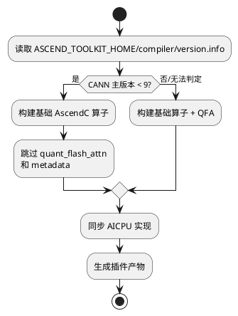
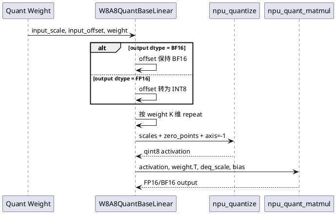

# BF16 Quant Offset 与 QFA 构建兼容问题定位报告

| 项目 | 内容 |
|---|---|
| 问题类型 | 量化参数 dtype 语义、CANN 能力探测、算子条件构建 |
| 关联 Issue | [Issue #163：sd_quantfa 接口未适配 A5](https://gitcode.com/Ascend/MindIE-SD/issues/163) |
| 修复 PR | [PR !339：Fix BF16 quant offset and QFA build compatibility](https://gitcode.com/Ascend/MindIE-SD/merge_requests/339) |
| 合入提交 | `609c37c67bae12ea5beae3514437aafe3c654262` |
| 变更规模 | 249 行新增、156 行删除、3 个文件 |
| 结论 | BF16 静态量化的 zero point 必须保持 BF16 语义；QFA 只能在支持其算子定义的 CANN 版本参与构建，低版本应按能力裁剪而不是让整个插件失败 |

## 1. 问题概述

该 PR 同时闭环了两个位于不同阶段、但都阻塞量化交付的问题：

1. W8A8 BF16 静态量化初始化时无条件把 `input_offset` 转为 INT8，破坏了 BF16 路径所需的 zero point dtype 契约，导致 UT 或运行行为异常。
2. 构建脚本无条件编译 `quant_flash_attn` 与 `quant_flash_attn_metadata`，而这些算子要求 CANN 9.0 及以上；使用低版本 CANN 时，整个自定义算子构建被不支持的 QFA 阻断。

Issue #163 提供了 A5-server、CANN 9.0、Torch 2.9 等环境信息，并标记为 bug/resolved；PR !339 通过 `Fixes #163` 与其关联。

## 2. 环境与复现条件

| 项目 | 配置 |
|---|---|
| 硬件 | Ascend A5 Server |
| CANN | 9.0；同时覆盖低于 9.0 的兼容构建路径 |
| PyTorch | 2.9 |
| 复现入口 | W8A8 BF16 静态量化初始化；`build_ops.sh` 自定义算子构建 |

## 3. 问题现象与影响范围

| 子问题 | 现象 | 影响 |
|---|---|---|
| BF16 offset | 构造后 `input_offset.dtype` 为 INT8 | BF16 量化参数语义错误，UT 或数值结果异常 |
| 低版本 CANN | QFA op 工程生成或编译失败 | 与 QFA 无关的其他算子也无法产出 |
| A5/QFA | 接口能力与硬件、CANN 组合不匹配 | 部署者难以判断是代码、硬件还是工具链问题 |



## 4. 分析与定位过程

### 4.1 将构建失败与运行时数值问题拆开

构建错误发生在 `build_ops.sh` 调用 `build_ascendc_ops.sh` 时，尚未进入 Python 量化层；BF16 offset 错误发生在权重加载后的 `_init_static_quant_param`。两个问题不能用同一种手段定位，需要分别检查工具链能力和张量 dtype。

### 4.2 检查 CANN 版本与算子集合

原脚本把基础算子与 QFA 算子写在同一个固定列表，并同时指定 910、910B、910_93、950 等 SOC。只要其中一个算子在当前 CANN 不存在，整次构建失败。定位后确认 QFA 两个算子要求 CANN 9.0 及以上，而 laser attention 等基础算子仍可在低版本构建。

### 4.3 追踪 offset dtype 转换

量化权重文件中的 `input_offset` 在加载后被无条件 `.to(torch.int8)`。对 FP16 分支该行为符合原有契约，但 BF16 分支也被强制截断。通过在 BF16 与 FP16 测试中分别断言 offset dtype，可直接锁定错误发生在初始化而非 `npu_quant_matmul`。



## 5. 根因

### 5.1 数值语义根因

代码把“量化后的激活 dtype 为 qint8”与“zero point 参数 dtype 必须是 int8”混为一谈。`npu_quantize` 的输出类型和参数类型是不同契约；BF16 量化路径需要 BF16 offset，提前转成 INT8 会丢失参数表达能力。

### 5.2 构建兼容根因

构建脚本按源码目录是否存在来决定编译，而没有按 CANN 提供的算子能力裁剪。新增 QFA 后，插件的最低 CANN 要求被整体抬高，违反“可选新算子不应阻塞基础算子构建”的兼容原则。

## 6. 解决方案

### 6.1 修正 BF16 offset dtype

```python
input_offset_dtype = torch.bfloat16 if self.dtype == torch.bfloat16 else torch.int8
input_offset = get_quant_weight(weights, key).to(input_offset_dtype)
```

随后保持原有按 weight K 维 repeat 的广播逻辑，并增加 FP16/ BF16 两条 dtype 断言。

### 6.2 按 CANN 版本选择算子

- 将 AscendC 算子拆为 `base_ascendc_ops` 和 `cann_9_required_ops`。
- 读取 `${ASCEND_TOOLKIT_HOME}/compiler/version.info`。
- 当 `Version` 主版本为 0 到 8 时，仅构建基础算子并输出明确 Warning。
- CANN 9.0 及以上加入 `quant_flash_attn` 和 `quant_flash_attn_metadata`。
- 保留无法读取版本时的原行为，避免未知新版本被错误裁剪。

## 7. 修复验证

PR Test Plan 明确要求“运行高低版本 CANN 编译和对应 UT”。可核实证据如下：

| 验证项 | 结果 |
|---|---|
| Issue 状态 | Issue #163 为 closed，标签包含 `bug`、`resolved` |
| BF16 dtype 用例 | 新增断言 `linear.input_offset.dtype == torch.bfloat16` |
| FP16 dtype 用例 | 新增断言 `linear.input_offset.dtype == torch.int8` |
| 覆盖率截图 | `layer.py` 67%，量化模块其他文件约 82% 到 100% |
| 流水线 | 完成记录为 1296；最终带 `ci-pipeline-passed`、`docs-ci-pipeline-success` 标签 |


推荐复现矩阵：

| 环境 | 预期构建行为 | 预期运行行为 |
|---|---|---|
| CANN 8.x | 跳过两个 QFA 算子，基础插件成功 | 非 QFA 能力正常 |
| CANN 9.x + 910B | 构建基础算子和 QFA | QFA UT/冒烟通过 |
| CANN 9.x + 950/A5 | 构建包含 ascend950 目标 | sd_quantfa 接口可加载 |
| BF16 W8A8 | 与 CANN 版本独立 | offset 保持 BF16，前向 shape/dtype 正常 |
| FP16 W8A8 | 与 CANN 版本独立 | offset 为 INT8，原行为不回退 |

证据边界：PR 截图展示覆盖率摘要，未展示每个 CANN/SOC 组合的完整构建日志。因此本文引用 PR 声明的高低版本验证计划和流水线通过结果，不虚构具体 CANN 小版本测试值。

## 8. 变更范围

- `build/build_ops.sh`：CANN 版本探测与 QFA 条件构建。
- `mindiesd/quantization/layer.py`：BF16/FP16 offset dtype 分支。
- `tests/quantization/test_layer.py`：dtype 回归断言和量化前向测试。

## 9. 预防措施

1. 可选新算子必须按工具链能力加入构建列表，不能隐式抬高整个包的最低版本。
2. 硬件型号、CANN 版本和算子能力是三维矩阵，Issue 环境信息应完整保留。
3. 量化调试必须分别检查 activation、scale、zero point、weight、dequant scale 的 dtype 和 shape。
4. 对数值参数的 dtype 断言比只检查输出 shape 更能防止静默精度回归。
5. 版本判断应有清晰 Warning，并在未来优先升级为能力探测而非永久依赖字符串解析。
