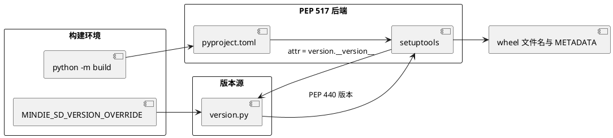
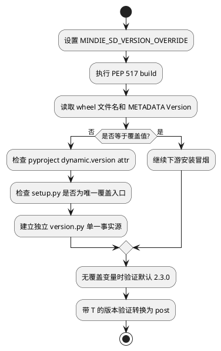

# PEP 517 构建版本覆盖失效问题定位报告

| 项目 | 内容 |
|---|---|
| 问题类型 | PEP 517 构建隔离、动态元数据、版本单一事实源 |
| 关联 Issue | [Issue #72：开源社区治理优化](https://gitcode.com/Ascend/MindIE-SD/issues/72) 中的 PEP 517 工程化子项 |
| 前序 PR | [PR !247：采用 PEP 517 构建流程](https://gitcode.com/Ascend/MindIE-SD/merge_requests/247) |
| 修复 PR | [PR !254：恢复 PEP 517 构建的版本覆盖能力](https://gitcode.com/Ascend/MindIE-SD/merge_requests/254) |
| 合入提交 | `68c4d05cc745cf752f20905265e39bf92b6c5e52` |
| 结论 | 将版本计算移到仓库根部独立 `version.py`，让 pyproject 动态元数据与 setup 构建逻辑读取同一结果，并保留环境变量覆盖及 PEP 440 转换 |

## 1. 问题概述

项目切换到 PEP 517 后，wheel 版本由 `pyproject.toml` 的动态元数据读取。原先 `setup.py` 中的 `MINDIE_SD_VERSION_OVERRIDE` 逻辑不再是所有构建入口的共同路径，导致 CI 或发布环境传入自定义版本时，产物仍可能使用仓库默认版本。

该问题会直接影响下游冒烟：测试脚本按预期版本名下载或安装 wheel，如果构建出的文件名不同，就会出现产物找不到、旧包被误装或发布版本不可追溯。

## 2. 环境与复现条件

| 项目 | 配置 |
|---|---|
| 构建方式 | `python -m build`，PEP 517 隔离构建 |
| 构建后端 | setuptools，`pyproject.toml` 动态版本 |
| 覆盖变量 | `MINDIE_SD_VERSION_OVERRIDE` |
| 复现条件 | 设置覆盖变量后构建 wheel，并核对文件名与 METADATA 中的 Version |

## 3. 问题现象与影响范围

- 设置 `MINDIE_SD_VERSION_OVERRIDE` 后，PEP 517 动态元数据仍可能读取固定 `2.3.0`。
- `setup.py` 与 `pyproject.toml` 分别参与版本解析，存在双事实源。
- 若为读取版本而导入 `mindiesd` 包，可能提前触发 torch_npu、算子插件等重依赖。
- 带时间戳的内部版本如 `9.9.9T20260415` 不符合 PEP 440，需要稳定转换为 `9.9.9post20260415`。
- 下游 QA 当时仍固定使用 `mindiesd-2.3.0-...whl`，切换默认版本会破坏既有冒烟流程。



## 4. 分析与定位过程

### 4.1 从产物名反查元数据入口

PR 的验证截图显示下游脚本明确删除、下载并安装 `mindiesd-2.3.0-cp311-cp311-linux_aarch64.whl`。因此问题首先表现为 wheel 名称契约，而 wheel 名称由构建元数据的 version 决定。

### 4.2 区分 setup.py 命令与 PEP 517 前端

传统 `python setup.py bdist_wheel` 会执行 setup.py 内的取版本逻辑；`python -m build` 通过 PEP 517 backend 读取 `pyproject.toml`。若环境变量覆盖只存在于 setup.py，两个入口会得到不同版本。

### 4.3 避免通过包导入读取版本

`pyproject.toml` 原配置从 `mindiesd._version.__version__` 读取。版本模块位于包内，工具在解析属性时可能涉及包导入语义。将独立版本文件放在仓库根部，可在不加载 MindIE-SD 运行时依赖的情况下执行简单版本计算。



## 5. 根因

根因是构建系统迁移时只迁移了“构建命令”，没有迁移“版本来源契约”。PEP 517 将元数据读取提前并隔离，setup.py 不再天然控制所有元数据。原设计使 pyproject attr 和 setup.py 环境变量覆盖形成两条不一致路径。

此外，版本模块放在业务包内部会让纯元数据查询潜在依赖业务包导入，这与构建隔离阶段应保持轻量、确定的要求冲突。

## 6. 解决方案

- 将 `mindiesd/_version.py` 移动为仓库根部 `version.py`。
- 在 `version.py` 中统一读取 `MINDIE_SD_VERSION_OVERRIDE`，缺省值保持 `2.3.0`。
- 对覆盖值执行 `.replace("T", "post")`，得到 PEP 440 可接受版本。
- `pyproject.toml` 改为 `version = { attr = "version.__version__" }`。
- `setup.py` 使用 `runpy.run_path(VERSION_FILE)` 读取同一版本结果，不再重复环境变量逻辑。
- 暂不改变默认版本，以兼容当时仍固定下载 2.3.0 wheel 的 QA 冒烟脚本。

## 7. 修复验证

新增 `tests/test_version_metadata.py` 覆盖三类契约：

| 用例 | 输入 | 期望结果 |
|---|---|---|
| pyproject 属性 | 读取 `pyproject.toml` | 指向 `version.__version__` |
| 默认版本 | 不设置覆盖变量 | `2.3.0` |
| 覆盖版本 | `9.9.9T20260415` | `9.9.9post20260415` |

PR Test Plan 为触发流水线构建，Test Report 记录“流水线通过”；评论中有流水线完成记录 1004，PR 最终带 `ci-pipeline-passed` 和 `docs-ci-pipeline-success` 标签。


产物级验证命令：

```bash
MINDIE_SD_VERSION_OVERRIDE=9.9.9T20260415 python -m build --wheel
python -m zipfile -e dist/mindiesd-9.9.9.post20260415-*.whl /tmp/mindiesd-wheel
grep '^Version:' /tmp/mindiesd-wheel/mindiesd-*.dist-info/METADATA
```

证据边界：PR 已记录流水线通过并有单元测试，但截图主要证明下游固定 wheel 文件名的约束，不是覆盖版本构建后的 METADATA 截图。

## 8. 变更范围

- `pyproject.toml`：PEP 517 动态版本入口。
- `version.py`：默认版本、环境变量覆盖和 PEP 440 归一化。
- `setup.py`：构建阶段读取统一版本源。
- `tests/test_version_metadata.py`：版本契约回归测试。

## 9. 预防措施

1. 构建系统迁移必须同时核对版本、依赖、包数据和入口点四类元数据。
2. 版本文件应可独立执行，不应依赖导入完整业务包。
3. 默认版本和发布覆盖版本必须来自同一事实源。
4. 单元测试之外还应检查 wheel 文件名、METADATA 和安装后的 `importlib.metadata.version`。
5. 下游脚本固定产物名时，版本迁移必须设计过渡窗口，避免正确修复触发链路故障。
