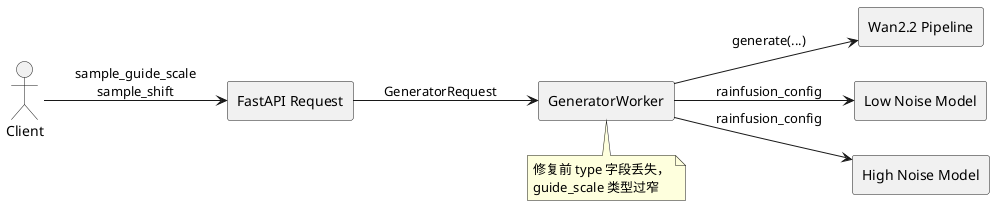
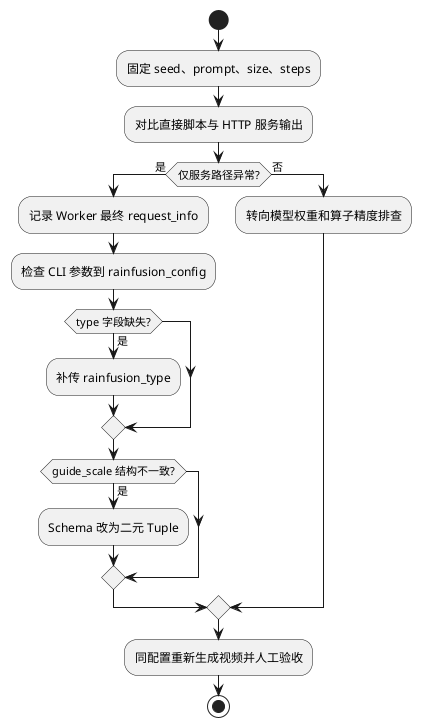

# Wan2.2 服务化推理精度异常问题定位报告

| 项目 | 内容 |
|---|---|
| 问题类型 | 服务参数链路丢失、请求 Schema 不匹配、多卡初始化顺序 |
| 修复 PR | [PR !217：同步 Wan2.2 并修复精度问题](https://gitcode.com/Ascend/MindIE-SD/merge_requests/217) |
| 合入提交 | `a8b6277be807d7f829ddbb8cd6b94cec1eb64890` |
| 变更规模 | 20 行新增、10 行删除、3 个文件 |
| 验证结论 | 补齐 `rainfusion_type` 和 Wan2.2 guidance 参数后，PR 记录 T2V 输出恢复正常，并提供生成结果截图 |
| 问题来源 | 已合入 Bugfix PR、代码差异和生成结果验证记录 |

## 1. 问题概述

Wan2.2 服务化样例能够启动并执行推理，但相同模型在服务调用路径下生成质量异常。问题容易被误判为模型权重、随机种子或稀疏算法本身的精度问题，实际根因位于 HTTP 请求、Worker 状态和模型 pipeline 之间的参数传递链。

修复涉及三个相互关联的点：

- `rainfusion_type` 在启动参数中存在，但构造和刷新 `rainfusion_config` 时未传入模型。
- Wan2.2 的 `sample_guide_scale` 需要低噪声/高噪声两段值，服务请求却声明为单个 float。
- 多进程 HCCL 初始化前未显式设置 NPU device 0，增加了服务化多卡初始化的不确定性。

## 2. 环境与复现条件

| 项目 | 配置 |
|---|---|
| 模型 | Wan2.2 T2V/I2V |
| 执行方式 | FastAPI 服务、Ray Worker、多 NPU HCCL |
| 优化配置 | RainFusion v2，双阶段 guidance |
| 对照组 | 相同权重、随机种子和生成参数下的直接脚本推理与服务推理 |

## 3. 问题现象与影响范围

- T2V 请求可以返回视频，但画面质量与直接脚本推理不一致。
- 使能 RainFusion 时，服务启动参数与模型实际收到的配置不一致。
- I2V/T2V 请求中的 guidance 参数可能被错误建模为标量，无法表达 Wan2.2 的双阶段配置。
- 多卡服务在进程组初始化阶段存在设备上下文不明确的风险。

## 4. 分析与定位过程

### 4.1 建立直接推理与服务推理的参数对照

当直接脚本输出正常、服务输出异常时，应保持模型、权重、prompt、seed、尺寸、步数和并行配置一致，只比较两条入口最终传给 pipeline 的参数。该方法将排查范围从模型计算收敛到服务适配层。

### 4.2 追踪 RainFusion 配置生命周期

`initialize_model` 创建 `rainfusion_config`，`_init_common_pipeline` 将配置写入低噪声和高噪声模型，`generate` 又会按请求刷新配置。修复前两个字典都只有 sparsity、skip_timesteps、grid_size、atten_mask_all，没有算法版本 `type`。即使命令行传入 `--rainfusion_type v2`，该信息也在进入模型前丢失。

### 4.3 检查请求 Schema 与模型签名

服务请求把 `sample_guide_scale` 定义为 `Optional[float]`，而 Wan2.2 示例需要 `[3.5, 3.5]` 表达两阶段 guidance。类型定义会限制或错误解释合法请求，因此修复为 `Optional[Tuple[float, float]]`。

## 5. 根因

根因是服务层复制了模型配置结构，却没有建立参数完整性约束。`rainfusion_type` 新增后，命令行解析层已经支持，但两个手工组装的字典没有同步，形成“参数表面存在、运行时实际失效”的静默错误。此类错误不会抛出异常，只会改变算法路径和最终生成质量，定位难度高于显式报错。

请求 Schema 的标量定义进一步造成直接推理示例与服务接口契约不一致，使同一模型无法使用相同 guidance 配置复现结果。

## 6. 解决方案

- 在模型初始化和每次请求刷新时，都向 `rainfusion_config` 写入 `"type": rainfusion_type`。
- 在 Worker 中持久化 `self.rainfusion_type`，确保后续请求不会丢失启动配置。
- 将 `sample_guide_scale` 从单个 float 改为两个 float 的 Tuple。
- 文档示例改为 `[3.5, 3.5]`，并显式传入 `sample_shift: 5.0`。
- 服务启动命令增加 `--rainfusion_type v2`。
- HCCL `init_process_group` 前执行 `torch.npu.set_device(0)`，固定进程设备上下文。

## 7. 修复验证

PR 正文记录“t2v 运行精度变正常”，并提供生成结果截图；PR 流水线完成记录为 897，最终带 `ci-pipeline-passed` 标签。

复现验证步骤：

| 步骤 | 控制变量 | 判定标准 |
|---|---|---|
| 直接推理基线 | 固定权重、seed、prompt、尺寸、steps | 保存基线视频 |
| 服务化推理 | 仅替换为 HTTP 入口 | 参数日志与基线一致 |
| RainFusion v2 | 确认 type、sparsity、skip_timesteps | 两个 noise model 配置一致 |
| 质量检查 | 同帧抽样或完整视频比较 | 无黑屏、花屏、异常色块，语义正常 |
| 连续请求 | 相同 seed 连续调用 | 配置不漂移，服务稳定 |

证据边界：PR 提供的是视觉结果和流水线通过记录，没有 PSNR、SSIM、VBench 等定量指标，也没有修复前后的成对视频。因此本文将结论表述为“PR 验证中视觉输出恢复正常”，不扩展为定量精度提升。

## 8. 变更范围

- `examples/service/request.py`：请求参数类型契约。
- `examples/service/worker.py`：RainFusion 配置构造、状态保存、pipeline 调用和 HCCL 初始化。
- `examples/service/service.md`：服务启动与请求示例。

## 9. 预防措施

1. 服务化精度异常先做“同输入双入口”对照，优先检查参数而非立即怀疑 kernel。
2. 配置字典不应在多个位置手工复制，宜使用统一 dataclass 或构造函数。
3. 新增算法参数必须覆盖 CLI、Schema、Worker 状态、模型配置、文档和日志六个入口。
4. 生成模型的精度验证应同时保留 seed、完整配置、输出文件和定量/人工判定记录。
5. 静默参数丢失应通过启动时配置 dump 和请求级结构化日志提前暴露。
