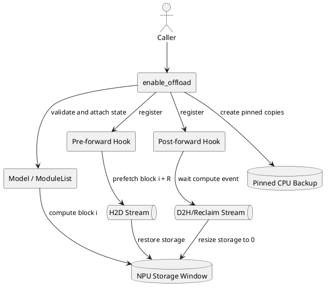
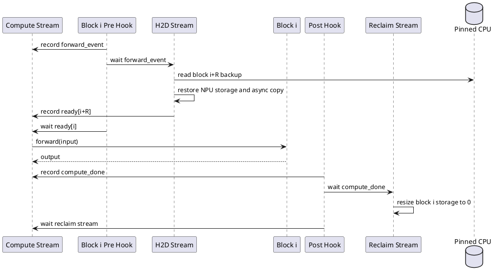
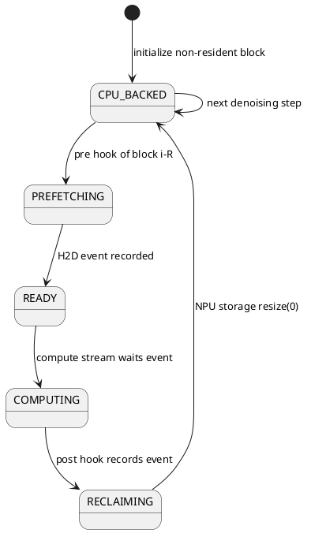
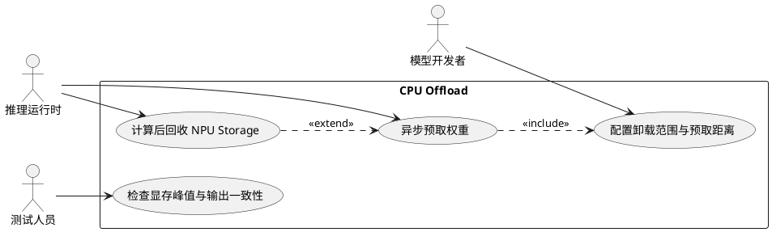
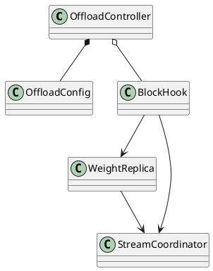

# CPU Offload 设计说明书

## 1. 文档概述

本文描述 MindIE-SD 面向 DiT 顺序 Block 的层级 CPU Offload 设计。该特性由本人负责设计与交付，对应 GitCode PR [!70](https://gitcode.com/Ascend/MindIE-SD/merge_requests/70)，并在后续演进中补充重复使能保护和事件顺序修复。PR !70 于 2026-01-17 合入，包含 330 行新增代码；主仓实现提交为 `7417137`，后续修复提交为 `fe5f819`。

## 2. 需求背景

视频与图像生成模型的 DiT 通常由大量同构 Block 串行组成。若所有权重常驻 NPU，模型规模、分辨率和序列长度会共同推高显存峰值。同步换入虽然能降低常驻显存，却会让计算流等待 Host-to-Device 搬运，吞吐下降明显。

本设计利用 Block 的确定执行顺序，把暂时不用的权重保存在 CPU 锁页内存中，并用独立 NPU Stream 预取后续 Block，使权重搬运与当前 Block 计算重叠。

## 3. 设计目标

- 通过限制 NPU 常驻 Block 数降低权重显存峰值。
- 在计算第 N 个 Block 时预取未来 Block，尽量隐藏 H2D 时延。
- 不侵入 Block 的 `forward` 实现，通过 PyTorch Hook 接入。
- 同时处理参数、Buffer 和非连续切片 Tensor。
- 参数非法、资源不可用时明确失败；重复使能保持幂等。

非目标：跨节点权重交换、训练态梯度 Offload、任意 DAG 自动调度和动态 Block 顺序推断。

## 4. 总体架构



`R=min_reserved_blocks_count` 表示预取距离与最低常驻窗口。初始化时所有 Block 先被搬到 NPU；从第 R 个 Block 开始，为参数和 Buffer 建立锁页 CPU 副本，并将 NPU Storage 缩为 0。运行时 Pre Hook 恢复未来 Block，Post Hook 在使用完成后释放当前 Block Storage。

## 5. 接口设计

```python
from mindiesd.offload import enable_offload

enable_offload(model, blocks, min_reserved_blocks_count=2)
```

| 参数 | 类型 | 约束 | 说明 |
|---|---|---|---|
| `model` | `torch.nn.Module` | 必选 | 被原地增强的模型 |
| `blocks` | `torch.nn.ModuleList` | 非空 | 按实际前向顺序排列的 Block |
| `min_reserved_blocks_count` | `int` | `0 <= R < len(blocks)` | 常驻窗口及预取距离，默认 2 |

函数无返回值，通过 `model.mindiesd_offload_enabled`、两个 Stream、事件数组及 Hook 保存运行态。重复调用直接返回，不会重复注册 Hook。

## 6. 核心流程



### 6.1 初始化

1. 校验模型、ModuleList、每个 Block 及预留数。
2. 创建 `h2d_stream`、`d2h_stream` 和逐 Block Event。
3. 将 Block 搬到 NPU。对非常驻 Block 建立 pinned CPU 副本。
4. 记录原始 Storage 大小；切片 Tensor 走 Tensor Copy，连续 Tensor 走底层 Storage Copy。
5. 清空非常驻 Block 的 NPU Storage，注册 Pre/Post Hook。

### 6.2 稳态流水

Pre Hook 计算 `to_device_index = block.index + R`，在 H2D Stream 中恢复目标 Storage 并异步复制。计算流在进入当前 Block 前等待其 ready Event。Post Hook 在计算完成 Event 之后回收当前非常驻 Block 的 Storage。

### 6.3 状态机



## 7. 模块设计

### 7.1 参数校验

所有配置错误在创建 NPU 资源前失败，并记录 issue、期望值、实际值和排障信息，避免半初始化并支持服务日志定位。

### 7.2 CPU 副本

CPU 副本使用 pinned memory，支持 `non_blocking=True` 的异步 H2D。副本在初始化后复用，稳态过程中不反复分配。当前实现面向推理期固定权重，不能用于参数会更新的训练流程。

### 7.3 Storage 回收

通过 `untyped_storage().resize_(0)` 释放底层 NPU Storage，同时保留 Parameter 对象、Shape、Dtype 和模块拓扑，避免每轮重建 Module。恢复时按保存的 `storage_size` 扩容并复制数据。

### 7.4 Hook 与事件

Hook 将生命周期逻辑与模型计算解耦。Event 明确表达“输入可用”和“计算完成”依赖，修复版本进一步保证事件记录顺序，并通过幂等标记避免重复 Hook 导致重复搬运。

## 8. DFX 设计

- 可靠性：类型、空列表、负数和越界配置均显式报错；NPU 资源错误向上传播。
- 可观测性：校验失败使用统一 MindIE-SD 日志前缀；生产集成记录每层 H2D、等待和峰值显存指标。
- 性能：收益取决于 Block 计算时间是否覆盖 H2D；`R` 太小会暴露搬运等待，太大则提高显存。
- 可维护性：仅依赖 ModuleList 顺序和 PyTorch Hook，无模型私有类依赖。
- 安全性：不反序列化外部数据；CPU 副本与模型权重同生命周期管理。

## 9. 测试设计

| 测试项 | 验证点 |
|---|---|
| 初始化 | Stream/Event 建立，常驻与非常驻 Storage 状态正确 |
| 完整前向 | 输出设备与 Shape 正确，前向后非常驻 Storage 已回收 |
| 幂等性 | 二次调用不增加 Hook 数量 |
| 切片 Tensor | 非连续 Storage 复制后数值一致 |
| 参数校验 | 类型、空 Block、负数及越界预留数均按契约失败 |
| 性能回归 | 对比同步 Offload 与不 Offload 的峰值显存、单步耗时和等待占比 |

## 10. 风险与约束

- 要求 Block 严格按传入顺序执行；条件分支、跳层或并发复用会破坏预取假设。
- CPU 内存必须容纳非常驻权重，且 Host-NPU 带宽决定性能上限。
- 权重在推理期间必须只读，否则 CPU 副本可能过期。
- `resize_(0)` 依赖底层 Storage 行为，升级 PyTorch/TorchNPU 时必须回归。
- 当前 Post Hook 的 D2H Stream 主要承担事件排序和 Storage 回收，稳态并不重新把权重复制回 CPU。

## 11. UML 用例图



## 12. UML 类图



## 13. 关键文件

- `mindiesd/offload.py`：入口、校验、Stream/Event、CPU 副本与 Hook。
- `tests/test_offload.py`：初始化、幂等、前向、切片与参数校验。
- `docs/zh/features/cpu_offload.md`、`docs/en/features/cpu_offload.md`：用户说明。
