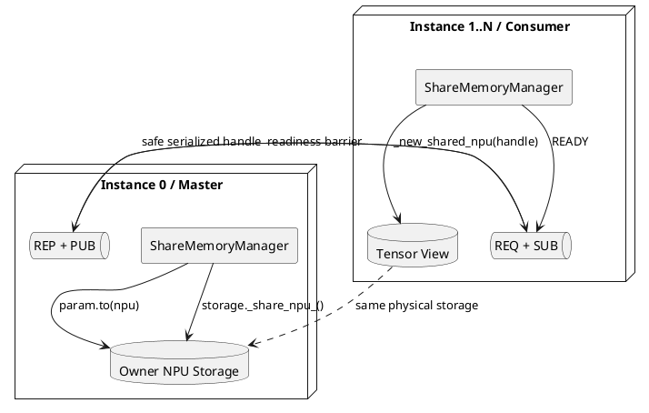
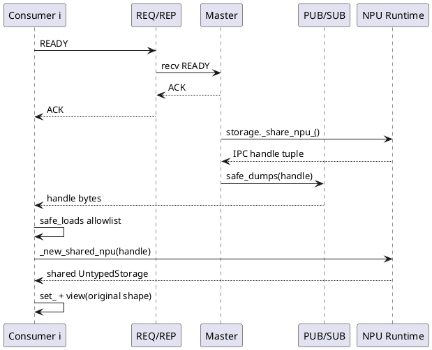
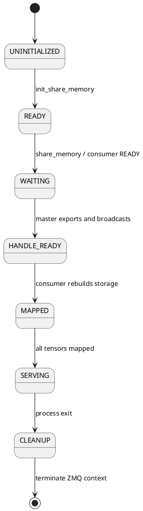
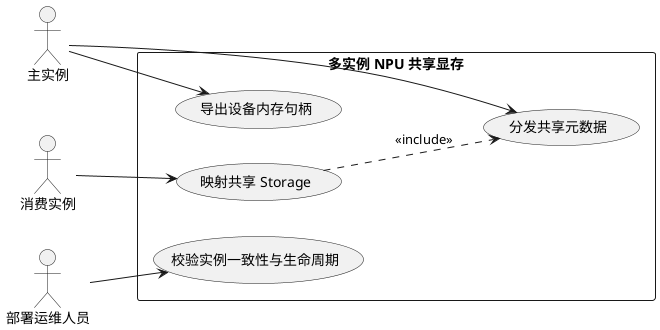
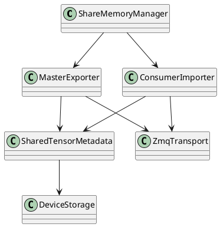

# 多实例 NPU 共享显存设计说明书

## 1. 文档概述

本文描述 MindIE-SD 多实例推理共享模型权重显存的设计。该特性由本人负责设计与交付，对应 GitCode PR [!71](https://gitcode.com/Ascend/MindIE-SD/merge_requests/71)，于 2026-01-17 合入，涉及 3 个文件、427 行新增；主仓实现提交为 `aa21204`。

## 2. 需求背景

同一节点上启动多个推理实例时，各进程通常各自把相同模型权重复制到同一张 NPU，权重显存随实例数线性增长。CANN 已提供 NPU Storage 导出与重建能力，但原生使用方式与特定多进程拉起方案绑定，不利于独立服务实例复用。

本设计把“句柄协调”和“Storage 共享”分层：ZeroMQ 只负责实例就绪屏障与句柄分发，权重数据本身通过 NPU IPC Storage 共享，不经网络复制。

## 3. 设计目标

- 0 号实例创建唯一权重 Storage，其余实例按句柄重建 Tensor 视图。
- 支持参数与 Buffer，保持原模块拓扑和 Shape。
- 不绑定 `torch.multiprocessing` 拉起方式，可由外部服务编排实例。
- 对未初始化、非法类型、通信超时和不适用设备提供明确处理。
- 句柄反序列化采用允许列表，避免不可信 Pickle 触发任意代码执行。

非目标：跨物理主机共享 NPU 显存、可写参数一致性、训练态共享优化器状态、通用 Tensor RPC。

## 4. 总体架构



## 5. 接口设计

```python
from mindiesd.share_memory import init_share_memory, share_memory

init_share_memory(instance_world_size=2, instance_id=instance_id,
                  master_addr="127.0.0.1", base_port=5555)
share_memory(pipeline.transformer, device="npu")
```

### 5.1 初始化接口

`init_share_memory` 创建进程内单例 `ShareMemoryManager`。`instance_id == 0` 为 Master；端口按 `base_port + device_id + 100` 计算 PUB 端口，REP 端口再加 1，避免同机不同 Device 冲突。

### 5.2 共享接口

`share_memory(module, device=None, dtype=None)` 原地迁移并返回 Module。CPU-to-CPU、Meta Device 或已经位于当前 NPU 的场景复用标准 `Module.to`/原对象路径；需要共享时才进入句柄协议。

## 6. 句柄分发时序



REQ/REP 形成显式就绪屏障，解决 PUB/SUB 的“慢加入者”丢消息问题。Master 等待 `instance_world_size - 1` 个 READY 后才广播每个 Storage 的句柄。Master 接收超时为 10 秒，Consumer 订阅接收超时为 5 秒。

## 7. 模块设计

### 7.1 ShareMemoryManager

负责实例角色、当前 NPU Device、端口派生、Socket 初始化和句柄广播。ZeroMQ Context 为进程单例，并在 `atexit` 阶段统一终止。

### 7.2 Master 路径

对每个 Parameter/Buffer：按目标 Device/Dtype 迁移，调用 `_share_npu_()` 导出底层 Storage 句柄，等待消费者就绪后广播。Master 始终持有 Owner Storage，生命周期不得短于消费者。

### 7.3 Consumer 路径

先创建同 Shape/Dtype 的目标 Tensor，再接收句柄并调用 `_new_shared_npu` 重建 UntypedStorage，通过 `set_` 和 `view` 恢复原 Shape，最后替换 `param.data`。

### 7.4 安全反序列化

当前实现不使用 `recv_pyobj()`，而是显式 `safe_dumps`/`safe_loads`。SafeUnpickler 允许列表限制可恢复类型，降低监听端口被伪造负载利用的风险。部署仍应将地址限制在受信网络。

## 8. 一致性与生命周期



权重面向只读推理。不同实例共享同一物理 Storage，因此任何原地写都会影响所有实例。服务编排必须保证 Master 不提前退出，并在全部 Consumer 完成映射前不释放模块。

## 9. DFX 设计

- 可靠性：未初始化抛 `ParametersInvalid`；握手和订阅均有超时；CPU/Meta/已在目标 NPU 的场景回退。
- 可观测性：记录 Master 广播地址、Device 和句柄收发阶段；不记录权重内容。
- 性能：控制面仅传句柄，数据面不复制权重；映射完成后推理没有额外 RPC。
- 安全性：安全反序列化、受信端口、禁止把 Socket 暴露到公网。
- 可维护性：Module 遍历统一覆盖 Parameter 与 Buffer，对上层模型类型无感。

## 10. 测试设计

| 测试项 | 验证点 |
|---|---|
| Master/Consumer 初始化 | 角色、Device、派生端口和 Socket 类型正确 |
| 就绪屏障 | 全部 Consumer READY 后才 PUB |
| 参数与 Buffer | Shape、Dtype、Device 和 Storage 映射正确 |
| 回退路径 | CPU、Meta、已在当前 NPU 时不走 IPC |
| 异常路径 | 未初始化、非法 Module/Dtype、超时均明确失败 |
| 多实例 E2E | 多进程推理输出一致，显存不随实例数线性增加 |
| 安全用例 | 非允许类型的序列化负载被拒绝 |

## 11. 风险与约束

- `master_addr` 支持远端控制消息，不等于 NPU Storage 能跨物理主机共享；数据面通常要求同机、同设备及兼容运行时。
- 依赖 TorchNPU 私有 Storage API，版本升级需要兼容性回归。
- 默认端口派生仍可能与其他服务冲突，部署应显式规划 `base_port`。
- Master 崩溃、句柄广播中断或实例数配置不一致会导致启动失败。
- 共享权重必须只读；若需要热更新，应采用版本化重建而非原地修改。

## 12. UML 用例图



## 13. UML 类图



## 14. 关键文件

- `mindiesd/share_memory.py`：管理器、握手、句柄导出/重建和回退逻辑。
- `mindiesd/utils/safe_pickle.py`：安全序列化边界。
- `tests/test_share_memory.py`：单元与多实例行为验证。
- `docs/zh/features/share_memory.md`、`docs/en/features/share_memory.md`：用户说明。
