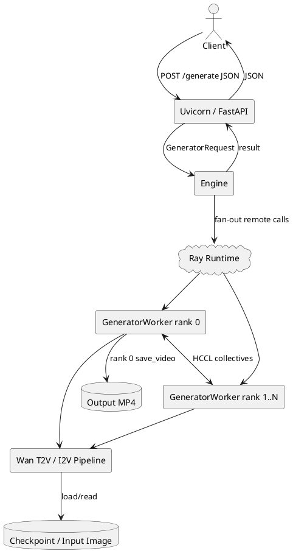
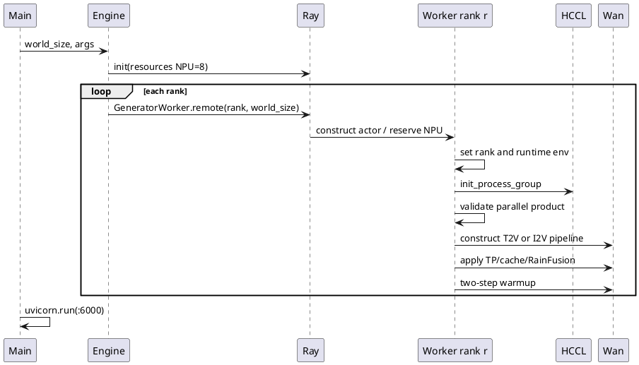
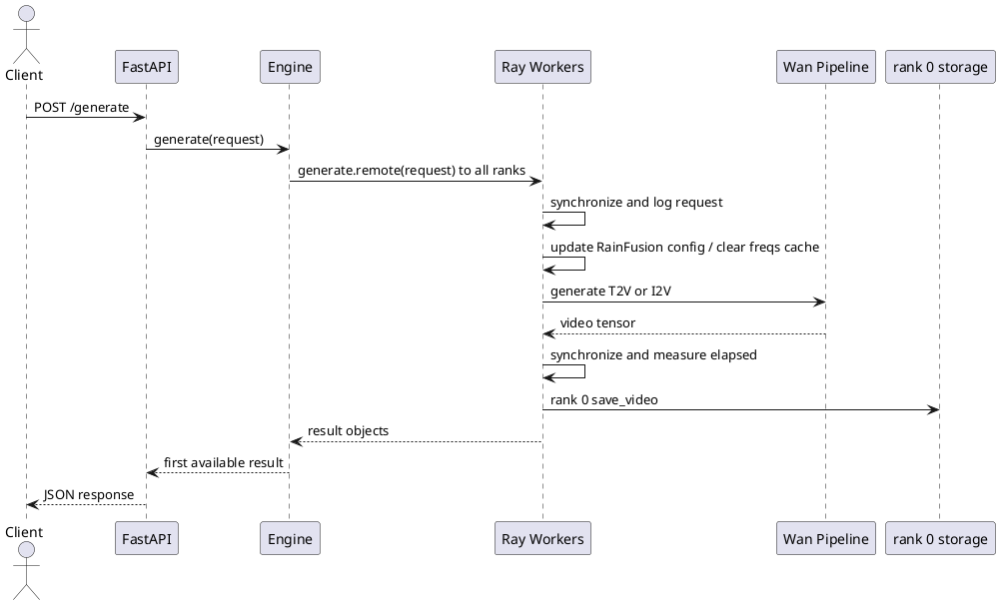
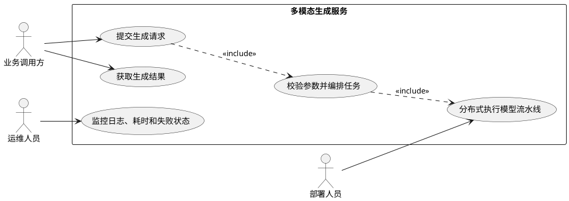
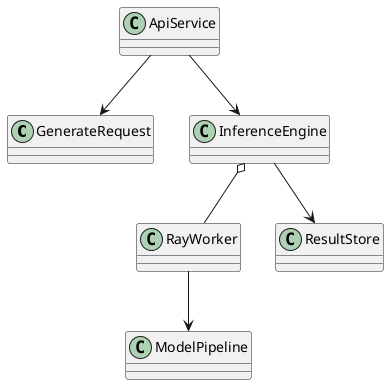

# 多模态生成服务化样例设计说明书

## 1. 文档概述

本文描述 MindIE-SD 基于 FastAPI、Ray 与 HCCL 的多 NPU 视频生成服务化样例。该工作由本人负责设计与交付，对应 GitCode PR [!66](https://gitcode.com/Ascend/MindIE-SD/merge_requests/66)，于 2026-01-14 合入，新增 4 个文件、560 行；PR [!217](https://gitcode.com/Ascend/MindIE-SD/merge_requests/217) 后续同步 Wan2.2 RainFusion 配置并修复 T2V 精度路径。

## 2. 需求背景

模型仓通常只提供命令行离线生成脚本，业务调用方需要自行处理 HTTP 契约、模型常驻、多 NPU 进程、并行组初始化、输入校验、结果落盘和性能日志。不同 T2V/I2V 模型参数又不完全一致，重复建设成本高。

本设计提供一套可运行参考：FastAPI 负责稳定请求边界，Engine 负责请求广播，Ray Actor 负责 NPU 资源隔离，Worker 负责模型相关初始化与推理。

## 3. 设计目标

- 提供统一 `POST /generate` 接口，覆盖文本生视频与图生视频。
- 模型在 Worker 启动时加载并预热，请求期间复用。
- 每个 Ray Worker 独占 1 个 NPU 资源，支持多卡协同推理。
- 支持 Ulysses、Ring、TP、CFG、FSDP、VAE 并行、AttentionCache 和 RainFusion 组合。
- 返回生成耗时和输出路径，统一异常为 HTTP 500。

非目标：生产级鉴权、限流、排队、取消、流式返回、多租户隔离和跨节点容灾。本实现定位是服务化接入样例。

## 4. 总体架构

## 5. 请求接口

`GeneratorRequest` 使用 Pydantic 定义以下主要字段：

| 字段 | 默认值 | 说明 |
|---|---|---|
| `prompt` | 必选 | 文本提示词 |
| `sample_steps` | 必选 | 采样步数 |
| `task` | `t2v-A14B` | T2V/I2V 任务类型 |
| `image` | `None` | I2V 输入图片路径 |
| `size` | `1280*720` | 输出分辨率配置键 |
| `frame_num` | 81 | 帧数 |
| `sample_guide_scale` | `None` | 引导强度，可为双阶段配置 |
| `sample_shift` | `None` | 采样 Shift |
| `base_seed` | 0 | 随机种子 |
| `offload_model` | `False` | 是否启用模型 Offload |
| `save_disk_path` | `None` | 输出文件路径；为空时自动生成 |

响应包含 `message`、`elapsed_time` 与 `output`。I2V 缺少图片时 Worker 抛出明确错误。

## 6. 初始化流程

并行度必须满足 `cfg_size * ulysses_size * ring_size * tp_size == world_size`。若 TP 与 DiT FSDP 同时配置，样例关闭 DiT FSDP；Ulysses 还要求 Attention Head 数可整除并行度。

## 7. 请求执行时序

## 8. 模块设计

### 8.1 API 层

FastAPI 完成 JSON 到 Pydantic 对象的转换，`/generate` 调用 Engine。已有 `HTTPException` 原样上抛，其余异常包装为 500，避免泄漏 Python 堆栈给客户端。

### 8.2 Engine 层

Engine 初始化 Ray 并按 `world_size` 创建等量 Actor。一次请求同步 fan-out 到全部 Rank，保证多卡模型每个 Rank 进入相同生成步骤；完成后聚合结果。

### 8.3 Worker 层

Worker 设置分布式环境，初始化 HCCL 与 Wan 配置，按任务创建 `WanT2V` 或 `WanI2V`。公共初始化统一注入 RainFusion、Tensor Parallel 和 AttentionCache；请求阶段同步 Seed、读取图片、调用 Pipeline、统计耗时并由 rank 0 落盘。

### 8.4 模型适配边界

Engine 与 HTTP 契约保持通用；模型差异集中在 `GeneratorRequest`、Worker 初始化和 `generate` 参数映射。迁移新模型时应复用 API/Engine，仅替换 Worker Adapter。

## 9. DFX 设计

- 可观测性：rank 0 记录请求摘要、模型配置、预热、生成耗时与输出路径；其他 Rank 降低日志级别。
- 可靠性：启动阶段验证并行乘积和 Head 可分性；请求阶段在生成前后同步 NPU Stream。
- 性能：模型常驻与预热消除逐请求加载；Ray 负责资源绑定；MindIE-SD Cache/RainFusion 可组合启用。
- 安全性：示例默认监听 `0.0.0.0` 且无鉴权，生产部署必须置于受控网关后，并校验输入/输出路径。
- 可维护性：请求、Server、Worker、使用文档四文件分层，模型适配点明确。

## 10. 测试设计

| 层级 | 测试内容 |
|---|---|
| Schema | 必填/默认字段、T2V/I2V 条件和非法 Shape |
| Engine | Worker 数等于 world size，请求对所有 Rank 广播 |
| 并行初始化 | 并行度乘积、Ulysses Head 整除、TP/FSDP 冲突处理 |
| Worker | T2V 与 I2V 参数映射、RainFusion v2、Cache 配置 |
| E2E | Wan2.2 多卡生成成功、输出视频可解码、固定 Seed 质量一致 |
| 性能 | 冷启动、预热后延迟、端到端吞吐和各 Rank 利用率 |
| 故障 | 图片缺失、磁盘失败、Worker 异常、HCCL 超时映射为可诊断响应 |

## 11. 风险与演进

- `ray.get` 位于 `async` 方法中，会阻塞事件循环；生产版应使用异步 ObjectRef 或后台任务队列。
- Ray 初始化资源数和 `args.world_size=8` 为样例常量，应改为设备发现与配置注入。
- 所有请求直接进入全部 Worker，缺少并发队列、背压、取消和超时控制。
- `save_disk_path` 与 `image` 是本地路径，生产环境必须做目录白名单、文件类型和权限校验。
- 当前只返回落盘路径，不提供对象存储上传或视频流；可后续抽象 Result Sink。
- 全局 Engine 生命周期依赖脚本直接启动；多 Worker Uvicorn 部署时需增加显式应用生命周期管理。

## 12. UML 用例图

## 13. UML 类图

## 14. 关键文件

- `examples/service/request.py`：HTTP 请求契约。
- `examples/service/server.py`：FastAPI、Engine 与 Ray Actor 编排。
- `examples/service/worker.py`：HCCL、Wan 模型、并行与优化特性适配。
- `examples/service/service.md`：启动与 Curl 示例。
- `examples/service/requirements.txt`：服务层依赖。
